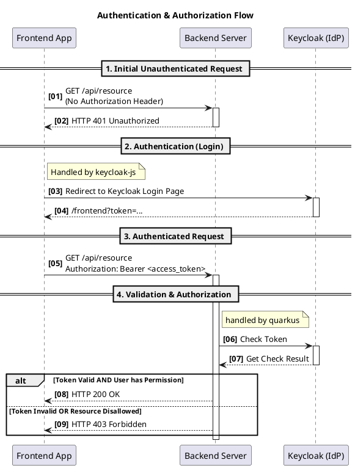

```plantuml
@startuml
skinparam responseMessageBelowArrow true
autonumber "<b>[00]</b>"

participant "Frontend App" as FE
participant "Backend Server" as BE
participant "Keycloak (IdP)" as KC

title Authentication & Authorization Flow

== 1. Initial Unauthenticated Request ==
FE -> BE: GET /api/resource\n(No Authorization Header)
activate BE
BE --> FE: HTTP 401 Unauthorized
deactivate BE

== 2. Authentication (Login) ==
note right of FE: Handled by keycloak-js
FE -> KC: Redirect to Keycloak Login Page
activate KC
KC --> FE: /frontend?token=...
deactivate KC

== 3. Authenticated Request ==
FE -> BE: GET /api/resource\nAuthorization: Bearer <access_token>
activate BE

== 4. Validation & Authorization ==
note right of BE
    handled by quarkus
end note


BE -> KC: Check Token
activate KC
KC --> BE: Get Check Result
deactivate KC

alt Token Valid AND User has Permission
    BE --> FE: HTTP 200 OK
else Token Invalid OR Resource Disallowed
    BE --> FE: HTTP 403 Forbidden
end

deactivate BE
@enduml
```
