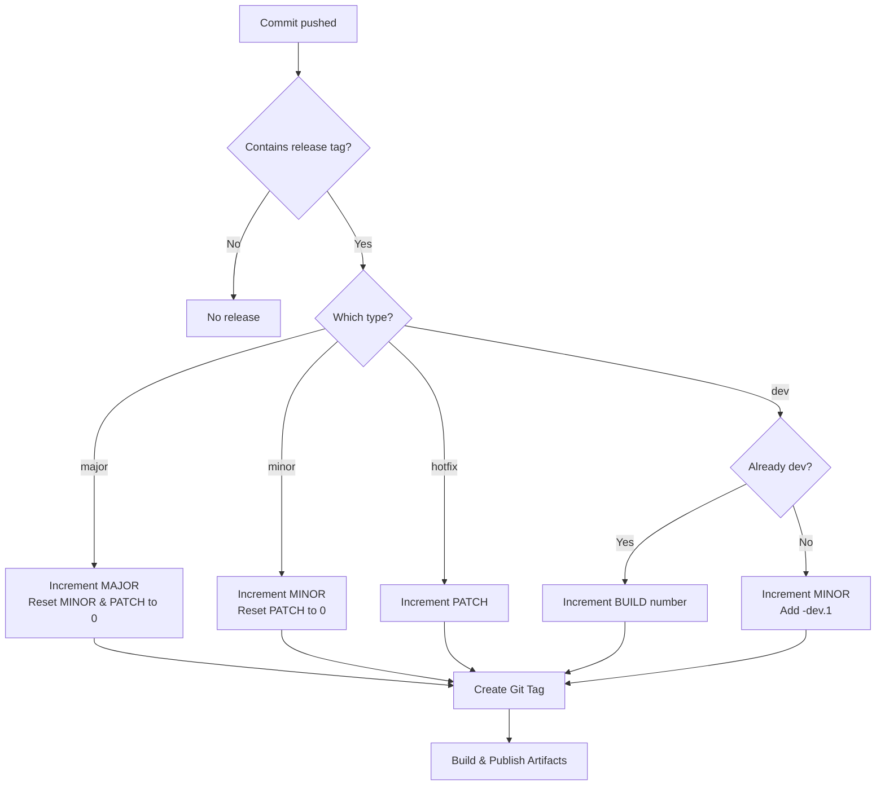

Franklyn follows [**Semantic Versioning (SemVer)**](https://semver.org/) 
in the format `MAJOR.MINOR.PATCH`, with an optional `-dev.BUILD` suffix
for internal pre-release builds.

## Version Format

```
MAJOR.MINOR.PATCH[-dev.BUILD]
```

- **MAJOR**: Incremented for incompatible API changes or breaking changes
- **MINOR**: Incremented for new features that are backward-compatible
- **PATCH**: Incremented for backward-compatible bug fixes (hotfixes)
- **dev.BUILD**: Optional pre-release suffix for internal testing builds

### Examples

| Version | Type     | Description |
|---------|----------|-------------|
| `0.1.0` | Minor    | Initial development release |
| `0.2.0-dev.1` | Dev      | Pre-release build for 0.2.0 |
| `0.2.0` | Minor    | New feature during initial development |
| `1.0.0` | Major    | First stable public API release |
| `1.1.0` | Minor    | New backward-compatible feature |
| `1.1.1` | Hotfix   | Bug fix for 1.1.0 |
| `1.2.0-dev.1` | Dev | First pre-release build for 1.2.0 |
| `1.2.0` | Minor    | Official 1.2.0 release |


**Initial Development (0.y.z):** Major version zero is for initial development. 
The public API should not be considered stable. Anything may change at any time.


## Dev (Pre-release)

Internal snapshot builds for testing **before** an official release. Uses the `-dev.BUILD` suffix with an incrementing build number.

- Not published as official releases
- Used for internal testing and CI/CD validation
- Pre-release for the upcoming version (comes before the release)

**Starting a dev chain (from stable):**
```
1.5.2 → 1.6.0-dev.1
```

**Incrementing an existing dev build:**
```
1.6.0-dev.1 → 1.6.0-dev.2 → 1.6.0-dev.3
```

**Releasing after dev:**
```
1.6.0-dev.3 → 1.6.0
```

## Triggering a Release

Releases are triggered by including a release type tag in the commit message:

| Commit Message Tag | Release Type | Version Change |
|--------------------|--------------|----------------|
| `[major]` | Major release | `x.y.z` → `(x+1).0.0` |
| `[minor]` | Minor release | `x.y.z` → `x.(y+1).0` |
| `[hotfix]` | Hotfix/Patch release | `x.y.z` → `x.y.(z+1)` |
| `[dev]` | Dev build | `x.y.z` → `x.(y+1).0-dev.N` |


### Example Commit Messages

```bash
# New feature release
git commit -m "feat: add student dashboard [minor]"

# Bug fix release
git commit -m "fix: resolve authentication timeout [hotfix]"

# Breaking API change
git commit -m "feat!: redesign REST API structure [major]"

# Internal testing build
git commit -m "feat: WIP dashboard improvements [dev]"
```

## Release Flow Diagram



## Version Precedence

Following SemVer rules, version precedence is determined by comparing each identifier from left to right:

1. **MAJOR** > **MINOR** > **PATCH**
2. Pre-release versions (`-dev.N`) have **lower precedence** than the associated normal version

```
0.1.0 < 0.2.0-dev.1 < 0.2.0-dev.2 < 0.2.0 < 1.0.0-dev.1 < 1.0.0 < 1.0.1 < 1.1.0
```


**Important:** `1.2.0-dev.1` comes **before** `1.2.0` in version order.  
Dev builds are pre-release candidates that precede the official release.


## Version File

The current version is stored in the `VERSION` file at the repository root.
This file is automatically updated during the release process.
This file should not be edited manually as it is completely managed by CI/CD.

## Version Script

The version generation is handled by the `./scripts/franver.sh` script, which is used in CI/CD to determine
the next version based on the release type.
Dev
### Usage

```bash
./scripts/franver.sh <release_type>
```

Where `<release_type>` is one of: `major`, `minor`, `hotfix`, `dev`.

### How It Works

1. Reads the latest Git tag matching `vX.Y.Z[-dev.BUILD]`
2. Parses the version components using regex
3. Calculates the next version based on the release type
4. Outputs the new version string (without the `v` prefix)


**Requirements:** The script requires a Git repository with proper tags to calculate versions. 
If no tags exist, it defaults to `v0.0.0` for calculation purposes.

