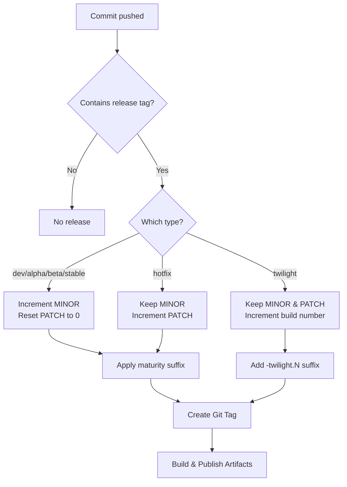
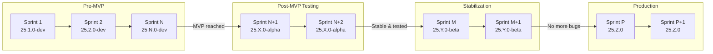


**Current Status:** We are in the **dev** stage (pre-MVP). All releases use the `-dev` suffix.


Franklyn uses a mix of [**CalVer** (Calendar Versioning)](https://calver.org/) 
and [**SemVer** (Semantic Versioning)](https://semver.org/) scheme 
in the format `YY.MINOR.PATCH`, with optional pre-release suffixes. 
The release schedule is aligned with our **2-week Scrum sprints**.

## Version Format

```
YY.MINOR.PATCH[-<prerelease>]
```

- **YY**: Two-digit year (e.g., `25` for 2025)
- **MINOR**: Sprint release number, incremented at the end of each sprint
- **PATCH**: Hotfix number for bug fixes released between sprints
- **prerelease**: Optional suffix indicating the project maturity stage

### Examples

| Version | Type | Description |
|---------|------|-------------|
| `25.1.0-dev` | Dev | Sprint 1 release (pre-MVP) |
| `25.2.0-dev` | Dev | Sprint 2 release (pre-MVP) |
| `25.5.0-alpha` | Alpha | Sprint 5 release (post-MVP, testing phase) |
| `25.5.1-alpha` | Hotfix | Bug fix between sprints |
| `25.8.0-beta` | Beta | Sprint 8 release (stable, well-tested) |
| `25.10.0` | Stable | Sprint 10 release (production-ready) |
| `25.10.1` | Hotfix | Bug fix for stable release |
| `25.10.0-twilight.3` | Twilight | Internal build #3 for testing |

## Sprint Release Schedule

Each **2-week sprint** results in a new **MINOR** version. Bug fixes between sprints are released as **PATCH** increments (hotfixes).

```
Sprint 1  →  25.1.0-dev
Sprint 2  →  25.2.0-dev
   ↳ hotfix  →  25.2.1-dev
Sprint 3  →  25.3.0-dev
...
```

## Project Maturity Stages

The pre-release suffix indicates the current maturity stage of the project:

### Dev (`-dev`)

Used during early development **before the Minimum Viable Product (MVP)** is reached.

- Core features are still being implemented
- Breaking changes are expected
- Not suitable for any production use

```
[dev] → 25.3.0-dev
```

### Alpha (`-alpha`)

Used **after MVP** is reached while the software is still being tested and refined.

- Core features are complete
- Software may still crash or have significant bugs
- Suitable for internal testing only

```
[alpha] → 25.5.0-alpha
```

### Beta (`-beta`)

Used when the software is **stable and well-tested** but not yet production-ready.

- No more frequent crashes
- Most bugs have been fixed
- Suitable for external testing / early adopters

```
[beta] → 25.8.0-beta
```

### Stable (no suffix)

Used when the software is **production-ready** with no known critical issues.

- All beta issues resolved
- Fully tested and validated
- Suitable for production use

```
[stable] → 25.10.0
```

## Other Release Types

### Hotfix

Bug fix releases **between sprints**. Increments the PATCH number on the current version.

```
[hotfix] → 25.5.1-alpha  (if current is 25.5.0-alpha)
[hotfix] → 25.10.1       (if current is 25.10.0)
```

### Twilight

Internal snapshot builds on the **current MINOR version** without creating a new sprint release. Useful for deploying to a testing environment mid-sprint.

- Not published as official releases
- Includes an incrementing build number
- Allows testing without bumping the minor version

```
[twilight] → 25.5.0-twilight.3
```

## Triggering a Release

Releases are triggered by including a release type tag in the commit message:

| Commit Message Tag | Release Type |
|--------------------|--------------|
| `[dev]` | Dev release (pre-MVP sprints) |
| `[alpha]` | Alpha release (post-MVP) |
| `[beta]` | Beta release (stable, tested) |
| `[stable]` | Stable release (production-ready) |
| `[hotfix]` | Hotfix release (between sprints) |
| `[twilight]` | Twilight build (internal testing) |

The tags are **case-insensitive**, so `[Dev]`, `[DEV]`, and `[dev]` all work.

### Example Commit Messages

```bash
# End of sprint release (during dev phase)
git commit -m "chore: sprint 3 release [dev]"

# Hotfix between sprints
git commit -m "fix: critical auth bypass vulnerability [hotfix]"

# Internal testing build
git commit -m "feat: WIP dashboard improvements [twilight]"

# First alpha release after MVP
git commit -m "chore: MVP complete, moving to alpha [alpha]"

# Production release
git commit -m "chore: prepare v25.10.0 release [stable]"
```

## Release Flow Diagram



## Project Lifecycle Overview



## Version File

The current version is stored in the `VERSION` file at the repository root.
This file is automatically updated during the release process.
This file should not be edited manually as this file is completely managed by CI/CD.

## Version Script

The version generation is handled by the `./scripts/franver.sh` script, which is used in CI/CD to determine
the next version based on the release type.

### Usage

```bash
./scripts/franver.sh <release_type>
```

Where `<release_type>` is one of: `dev`, `alpha`, `beta`, `stable`, `hotfix`, `twilight`.


**Requirements:** The script requires a Git repository with proper tags to calculate versions. 
It uses existing `vYY.MINOR.PATCH` tags to determine the next version number.


