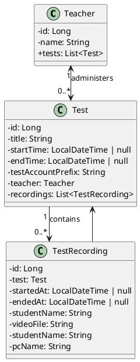

```plantuml
@startuml

' Styling to make the diagram cleaner
skinparam classAttributeIconSize 0
skinparam linetype ortho

class Teacher {
    -id: Long
    -name: String
    ' OneToMany side
    +tests: List<Test>
}

class Test {
    -id: Long
    -title: String
    -startTime: LocalDateTime | null
    -endTime: LocalDateTime | null
    -testAccountPrefix: String
    ' ManyToOne side
    -teacher: Teacher
    ' OneToMany side
    -recordings: List<TestRecording>
}

class TestRecording {
    -id: Long
    -test: Test
    -startedAt: LocalDateTime | null
    -endedAt: LocalDateTime | null
    ' ManyToOne side
    -studentName: String
    ' OneToOne side (owning)
    -videoFile: String
    -studentName: String
    -pcName: String
}

Teacher "1" <--> "0..*" Test : administers

Test "1" --> "0..*" TestRecording : contains

TestRecording --> Test

@enduml
```
