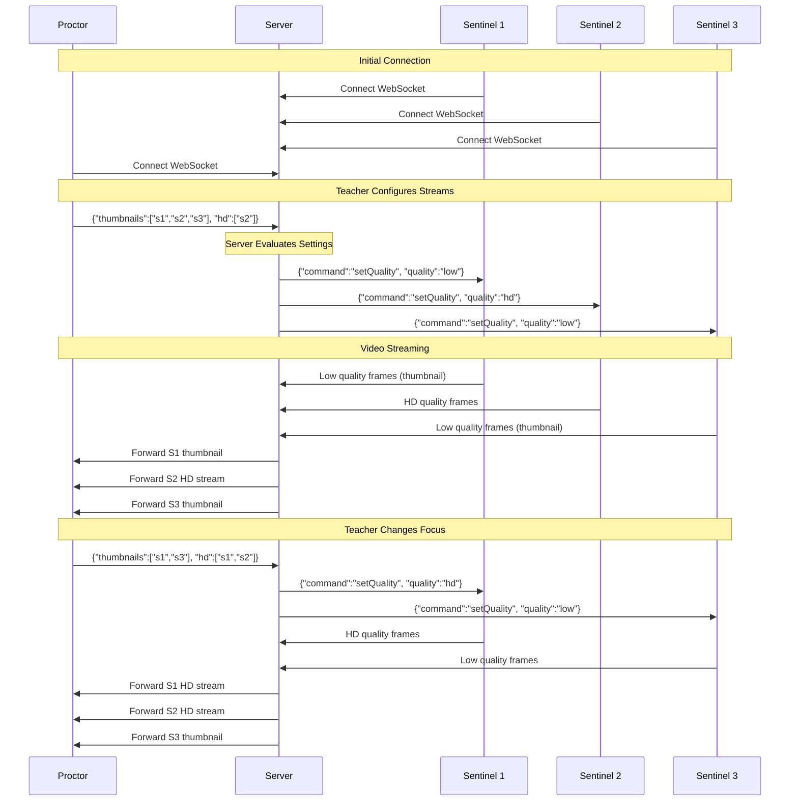

```mermaid
sequenceDiagram
    participant Teacher as Proctor
    participant Server as Server
    participant S1 as Sentinel 1
    participant S2 as Sentinel 2
    participant S3 as Sentinel 3

    Note over Teacher,S3: Initial Connection
    S1->>Server: Connect WebSocket
    S2->>Server: Connect WebSocket
    S3->>Server: Connect WebSocket
    Teacher->>Server: Connect WebSocket

    Note over Teacher,S3: Teacher Configures Streams
    Teacher->>Server: {"thumbnails":["s1","s2","s3"], "hd":["s2"]}

    Note over Server: Server Evaluates Settings
    Server->>S1: {"command":"setQuality", "quality":"low"}
    Server->>S2: {"command":"setQuality", "quality":"hd"}
    Server->>S3: {"command":"setQuality", "quality":"low"}

    Note over Teacher,S3: Video Streaming
    S1->>Server: Low quality frames (thumbnail)
    S2->>Server: HD quality frames
    S3->>Server: Low quality frames (thumbnail)

    Server->>Teacher: Forward S1 thumbnail
    Server->>Teacher: Forward S2 HD stream
    Server->>Teacher: Forward S3 thumbnail

    Note over Teacher,S3: Teacher Changes Focus
    Teacher->>Server: {"thumbnails":["s1","s3"], "hd":["s1","s2"]}

    Server->>S1: {"command":"setQuality", "quality":"hd"}
    Server->>S3: {"command":"setQuality", "quality":"low"}

    S1->>Server: HD quality frames
    S3->>Server: Low quality frames

    Server->>Teacher: Forward S1 HD stream
    Server->>Teacher: Forward S2 HD stream
    Server->>Teacher: Forward S3 thumbnail
```
