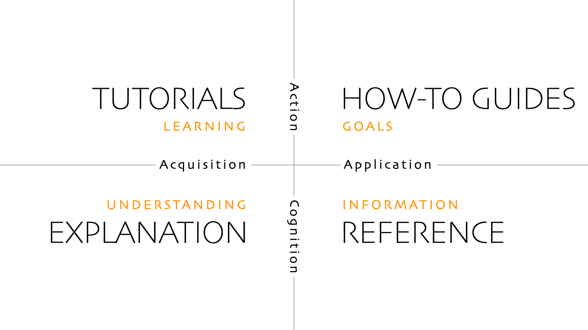

Wir verwenden [Diátaxis](https://diataxis.fr) als Leitfaden für das Verfassen unserer Dokumentation.

## Grobe Struktur

### How-To Anleitungen

- Deployment
- Deployment lokal testen
- Teilprojekte starten (proctor, hugo, server, sentinel)

### Tutorials

### Referenz

- Server-Klassendiagramm

### Erklärungen

- CI/CD-Pipelines
- Authentifizierungs-Diagramme
- Release-Lebenszyklus
- Projektsetup
- Projektrichtlinien pro Teilprojekt (hugo, server, sentinel)
  - Lints
  - Tests
