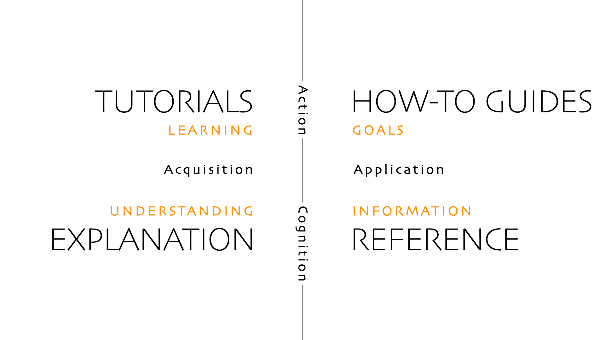

We use [Diátaxis](https://diataxis.fr) as our guiding hand in writing our documentation.

## Rough structure

### How-To Guides

- Deploy
- Test Deployment locally
- Start subprojects (proctor, hugo, server, sentinel)

### Tutorials

### Reference

- Server Class Diagram

### Explanation

- CI/CD Pipelines
- Authentication Diagrams
- Release Lifecycle
- Project setup
- Project guidelines per project (hugo, server, sentinel)
  - lints
  - tests
