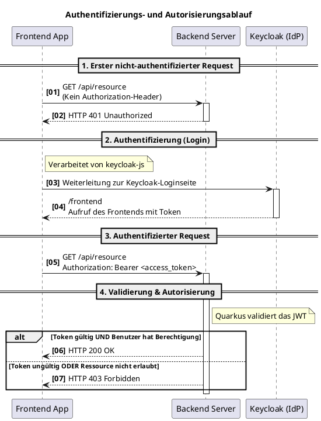

```plantuml
@startuml
skinparam responseMessageBelowArrow true
autonumber "<b>[00]</b>"

participant "Frontend App" as FE
participant "Backend Server" as BE
participant "Keycloak (IdP)" as KC

title Authentifizierungs- und Autorisierungsablauf

== 1. Erster nicht-authentifizierter Request ==
FE -> BE: GET /api/resource\n(Kein Authorization-Header)
activate BE
BE --> FE: HTTP 401 Unauthorized
deactivate BE

== 2. Authentifizierung (Login) ==
note right of FE: Verarbeitet von keycloak-js
FE -> KC: Weiterleitung zur Keycloak-Loginseite
activate KC
KC --> FE: /frontend \nAufruf des Frontends mit Token
deactivate KC

== 3. Authentifizierter Request ==
FE -> BE: GET /api/resource\nAuthorization: Bearer <access_token>
activate BE

== 4. Validierung & Autorisierung ==
note right of BE
    Quarkus validiert das JWT
end note


alt Token gültig UND Benutzer hat Berechtigung
    BE --> FE: HTTP 200 OK
else Token ungültig ODER Ressource nicht erlaubt
    BE --> FE: HTTP 403 Forbidden
end

deactivate BE
@enduml
```
