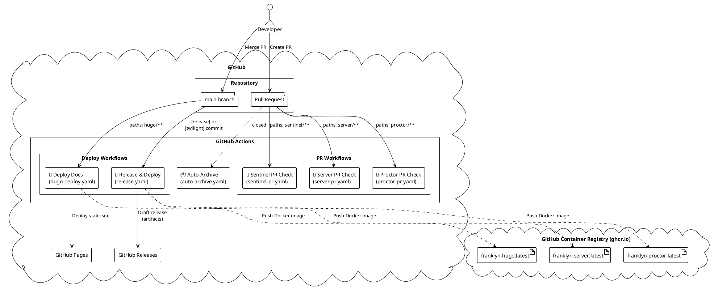
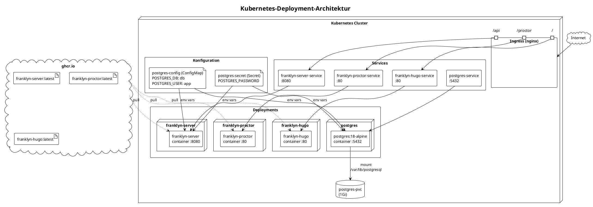
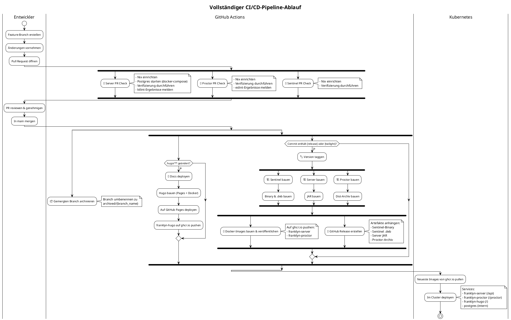

Diese Seite beschreibt das CI/CD-Setup des Projekts.

## GitHub Actions

Das folgende Diagramm zeigt die GitHub Actions Workflows.

## Kubernetes-Deployment

Das folgende Diagramm zeigt die Kubernetes-Deployment-Architektur.

## Vollständiger CI/CD-Ablauf

