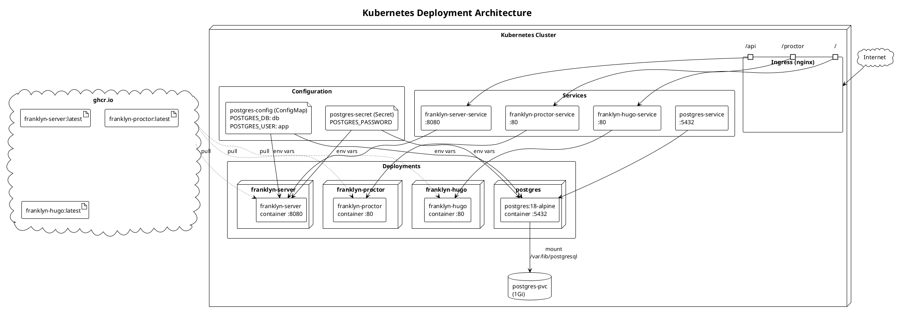

This page describes the CI/CD setup of the project.

## GitHub Actions

The following diagram shows the GitHub Actions workflows.

```plantuml
@startuml
!theme plain
skinparam componentStyle rectangle

' Actors
actor Developer

cloud "GitHub" as GH {
    rectangle "Repository" as Repo {
        file "main branch" as main
        file "Pull Request" as PR
    }
    
    rectangle "GitHub Actions" as Actions {
        rectangle "PR Workflows" as PRWorkflows {
            component "🔄 Server PR Check\n(server-pr.yaml)" as ServerPR
            component "🔄 Proctor PR Check\n(proctor-pr.yaml)" as ProctorPR
            component "🔄 Sentinel PR Check\n(sentinel-pr.yaml)" as SentinelPR
        }
        
        rectangle "Deploy Workflows" as DeployWorkflows {
            component "🚀 Deploy Docs\n(hugo-deploy.yaml)" as HugoDeploy
            component "🎉 Release & Deploy\n(release.yaml)" as Release
        }
        
        component "📦 Auto-Archive\n(auto-archive.yaml)" as AutoArchive
    }
    
    rectangle "GitHub Pages" as Pages
    rectangle "GitHub Releases" as Releases
}

cloud "GitHub Container Registry (ghcr.io)" as GHCR {
    artifact "franklyn-hugo:latest" as HugoImage
    artifact "franklyn-server:latest" as ServerImage
    artifact "franklyn-proctor:latest" as ProctorImage
}

' Force vertical layout
Developer -[hidden]down-> GH
GH -[hidden]down-> GHCR

' PR Workflow triggers
PR --> ServerPR : "paths: server/**"
PR --> ProctorPR : "paths: proctor/**"
PR --> SentinelPR : "paths: sentinel/**"

' Merge/Push triggers
main --> HugoDeploy : "paths: hugo/**"
main --> Release : "[release] or\n[twilight] commit"
PR -[dotted]-> AutoArchive : "closed"

' Outputs
HugoDeploy --> Pages : "Deploy static site"
HugoDeploy .d.> HugoImage : "Push Docker image"

Release --> Releases : "Draft release\n(artifacts)"
Release .d.> ServerImage : "Push Docker image"
Release .d.> ProctorImage : "Push Docker image"

Developer --> PR : "Create PR"
Developer --> main : "Merge PR"

@enduml
```

## Kubernetes Deployment

The following diagram shows the Kubernetes deployment architecture.

## Complete CI/CD Flow

```plantuml
@startuml
!theme plain

title Complete CI/CD Pipeline Flow

|Developer|
start
:Create feature branch;
:Make changes;
:Open Pull Request;

|GitHub Actions|
fork
    :🔄 Server PR Check;
    note right
        - Setup Nix
        - Start Postgres (docker-compose)
        - Run verification
        - Report ktlint results
    end note
fork again
    :🔄 Proctor PR Check;
    note right
        - Setup Nix
        - Run verification
        - Report eslint results
    end note
fork again
    :🔄 Sentinel PR Check;
    note right
        - Setup Nix
        - Run verification
    end note
end fork

|Developer|
:Review & Approve PR;
:Merge to main;

|GitHub Actions|
split
    :📦 Auto-Archive merged branch;
    note right
        Rename branch to
        archived/{branch_name}
    end note
    kill
split again
    fork
        if (hugo/** changed?) then (yes)
            :🚀 Deploy Docs;
            :Build Hugo (Pages + Docker);
            :Deploy to GitHub Pages;
            :Push franklyn-hugo to ghcr.io;
        endif
    fork again
        if (commit contains [release] or [twilight]?) then (yes)
            :🏷️ Tag version;
            
            fork
                :🏗️ Build Sentinel;
                :Build binary & .deb;
            fork again
                :🏗️ Build Server;
                :Build JAR;
            fork again
                :🏗️ Build Proctor;
                :Build dist archive;
            end fork
            
            fork
                :🐳 Build & Publish Docker Images;
                note right
                    Push to ghcr.io:
                    - franklyn-server
                    - franklyn-proctor
                end note
            fork again
                :🎉 Draft GitHub Release;
                note right
                    Attach artifacts:
                    - Sentinel binary
                    - Sentinel .deb
                    - Server JAR
                    - Proctor archive
                end note
            end fork
        endif
    end fork
end split

|Kubernetes|
:Pull latest images from ghcr.io;
:Deploy to cluster;
note right
    Services:
    - franklyn-server (/api)
    - franklyn-proctor (/proctor)  
    - franklyn-hugo (/)
    - postgres (internal)
end note

stop

@enduml
```

