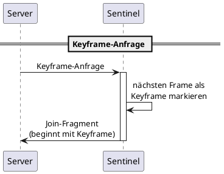
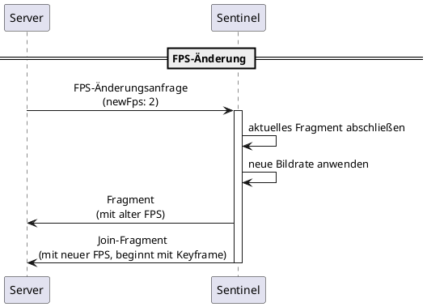

Dieses Dokument spezifiziert die Steuernachrichten für Keyframe-Anfragen und FPS-Änderungen.

## Übersicht

Steuernachrichten ermöglichen die Koordination zwischen Komponenten ohne Videodaten zu übertragen.

| Nachrichtentyp | Richtung | Zweck |
|--------------|-----------|---------|
| Keyframe-Anfrage | Server → Sentinel | Sofortigen Keyframe anfordern |
| FPS-Änderungsanfrage | Server → Sentinel | Erfassungsbildrate ändern |

## Keyframe-Anfrage

Ermöglicht es dem Server, einen On-Demand-Keyframe von einem Sentinel anzufordern.

### Ablaufdiagramm



### Anfragenachricht (Server → Sentinel)

| Feld | Typ | Erforderlich | Beschreibung |
|-------|------|----------|-------------|
| `type` | string | ja | Nachrichtentyp-Kennung |

Beispiel:

```json
{
  "type": "keyframe.request"
}
```

### Sentinel-Verhalten

Wenn der Sentinel eine Keyframe-Anfrage empfängt:

1. Der nächste erfasste Frame wird zu einem IDR-Frame (Keyframe)
2. Ein neues Join-Fragment beginnt mit diesem Keyframe
3. Das Join-Fragment wird wie gewöhnlich an den Server gesendet


Der Keyframe wird bei der **nächsten Erfassung** generiert, nicht sofort. Die Verzögerung hängt von der aktuellen Bildrate ab. Bei 5 FPS beträgt die maximale Verzögerung 200 ms. Bei 1/5 FPS beträgt die maximale Verzögerung 5 Sekunden.


### Antwort

Es ist keine explizite Antwortnachricht definiert. Der Server weiß, dass die Keyframe-Anfrage erfüllt wurde, wenn ein neues Join-Fragment eintrifft.

## FPS-Änderungsanfrage

Ermöglicht es dem Server, eine Bildratenänderung von einem Sentinel anzufordern.

### Ablaufdiagramm



### Anfragenachricht (Server → Sentinel)

| Feld | Typ | Erforderlich | Beschreibung |
|-------|------|----------|-------------|
| `type` | string | ja | Nachrichtentyp-Kennung |
| `framerate` | number | ja | Neue Zielbildrate (0,2 bis 5) |

Beispiel:

```json
{
  "type": "fps.change",
  "framerate": 2
}
```

### Sentinel-Verhalten

Wenn der Sentinel eine FPS-Änderungsanfrage empfängt:

{}

### Aktuelles Segment abschließen

Das aktuelle Fragment mit der alten Bildrate abschließen und senden.

### Keyframe generieren

Der nächste Frame ist ein IDR-Frame, der ein neues Join-Fragment beginnt.

### Neue Bildrate anwenden

Mit der neuen Bildrate erfassen.

### Streaming fortsetzen

Neue Fragmente werden mit der neuen Bildrate gesendet.

{}

### Bildraten-Grenzen

| Grenze | Wert | Verhalten bei Überschreitung |
|-------|-------|---------------------|
| Minimum | 0,2 fps (1 Frame pro 5 Sekunden) | Auf Minimum begrenzen |
| Maximum | 5 fps | Auf Maximum begrenzen |

Wenn die angeforderte Bildrate außerhalb der Grenzen liegt, begrenzt der Sentinel sie und wendet den begrenzten Wert an.

### Antwort

Es ist keine explizite Antwortnachricht definiert. Der Server beobachtet die Bildratenänderung über Fragment-Metadaten.

## Server-initiiert vs. Proctor-initiiert

| Nachricht | Wer initiiert | Rolle des Servers |
|---------|---------------|---------------|
| Keyframe-Anfrage | Server | Vom Server initiiert |
| FPS-Änderung | Server | Vom Server initiiert |

Der Proctor kann keine FPS-Änderung oder Keyframe-Anfrage direkt anfordern. Dies sind Entscheidungen des Servers basierend auf:

- Server-Last
- Netzwerkbedingungen
- Administrativer Richtlinie

## Timing-Garantien

| Nachricht | Timing |
|---------|--------|
| Keyframe-Anfrage | Keyframe bei nächster Erfassung (bis zu 1/Bildrate Verzögerung) |
| FPS-Änderung | Wirkt beim nächsten Join-Fragment |

## Fehlerbehandlung

### Fehler bei Keyframe-Anfrage

| Bedingung | Behandlung |
|-----------|----------|
| Sentinel nicht gefunden | Server gibt Fehler an Proctor zurück |
| Sentinel offline | Server gibt Fehler an Proctor zurück |
| Anfrage während Kodierung | Sentinel stellt Anfrage für nächsten Frame in Warteschlange |

### Fehler bei FPS-Änderung

| Bedingung | Behandlung |
|-----------|----------|
| Ungültige Bildrate | Sentinel begrenzt auf gültigen Bereich |
| Sentinel beschäftigt | Sentinel wendet Änderung an nächster Join-Fragment-Grenze an |

## Zusammenfassung der Nachrichtentypen

| Typ-Kennung | Richtung | Beschreibung |
|-----------------|-----------|-------------|
| `keyframe.request` | Server → Sentinel | Keyframe für einen Sentinel anfordern |
| `fps.change` | Server → Sentinel | Bildratenänderung anfordern |


Die gezeigten Typ-Kennungen sind Beispiele. Implementierungen können andere Namenskonventionen verwenden, solange die Semantik erhalten bleibt.

