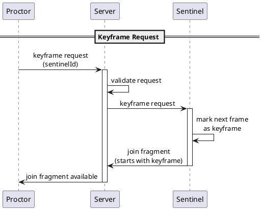
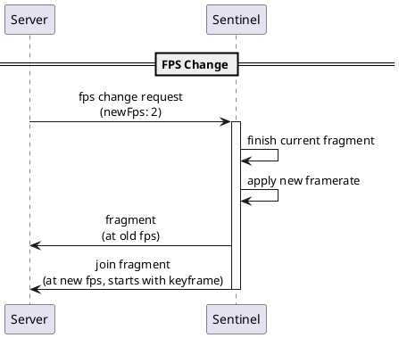

This document specifies the control messages for keyframe requests and FPS changes.

## Overview

Control messages allow coordination between components without transferring video data.

| Message Type | Direction | Purpose |
|--------------|-----------|---------|
| Keyframe Request | Proctor → Server → Sentinel | Request immediate keyframe |
| FPS Change Request | Server → Sentinel | Change capture framerate |

## Keyframe Request

Allows a Proctor (via Server) to request an on-demand keyframe from a Sentinel.

### Flow Diagram



### Request Message (Proctor → Server)

| Field | Type | Required | Description |
|-------|------|----------|-------------|
| `sentinelId` | string | yes | Target Sentinel |

Example:

```json
{
  "type": "keyframe.request",
  "sentinelId": "sentinel-a1b2c3"
}
```

### Request Message (Server → Sentinel)

| Field | Type | Required | Description |
|-------|------|----------|-------------|
| `type` | string | yes | Message type identifier |

Example:

```json
{
  "type": "keyframe.request"
}
```

### Sentinel Behavior

When the Sentinel receives a keyframe request:

1. The next captured frame becomes an IDR frame (keyframe)
2. A new join fragment begins with this keyframe
3. The join fragment is sent to the Server as usual


The keyframe is generated on the **next capture**, not immediately. The delay depends on the current framerate. At 5 FPS, maximum delay is 200ms. At 1/5 FPS, maximum delay is 5 seconds.


### Response

No explicit response message is defined. The Proctor knows the keyframe request was fulfilled when a new join fragment arrives.

## FPS Change Request

Allows the Server to request a framerate change from a Sentinel.

### Flow Diagram



### Request Message (Server → Sentinel)

| Field | Type | Required | Description |
|-------|------|----------|-------------|
| `type` | string | yes | Message type identifier |
| `framerate` | number | yes | New target framerate (0.2 to 5) |

Example:

```json
{
  "type": "fps.change",
  "framerate": 2
}
```

### Sentinel Behavior

When the Sentinel receives an FPS change request:

{}

### Finish Current Segment

Complete and send the current fragment with the old framerate.

### Generate Keyframe

The next frame is an IDR frame, starting a new join fragment.

### Apply New Framerate

Begin capturing at the new framerate.

### Continue Streaming

New fragments are sent at the new framerate.

{}

### Framerate Bounds

| Bound | Value | Behavior if Exceeded |
|-------|-------|---------------------|
| Minimum | 0.2 fps (1 frame per 5 seconds) | Clamp to minimum |
| Maximum | 5 fps | Clamp to maximum |

If the requested framerate is outside bounds, the Sentinel clamps it and applies the bounded value.

### Response

No explicit response message is defined. The Server observes the framerate change via fragment metadata.

## Server-Initiated vs Proctor-Initiated

| Message | Who Initiates | Server's Role |
|---------|---------------|---------------|
| Keyframe Request | Proctor | Relay to Sentinel |
| FPS Change | Server | Originates from Server |

The Proctor cannot directly request an FPS change. FPS changes are a Server-side decision based on:

- Server load
- Network conditions
- Administrative policy

## Timing Guarantees

| Message | Timing |
|---------|--------|
| Keyframe Request | Keyframe on next capture (up to 1/framerate delay) |
| FPS Change | Takes effect on next join fragment |

## Error Handling

### Keyframe Request Errors

| Condition | Handling |
|-----------|----------|
| Sentinel not found | Server returns error to Proctor |
| Sentinel offline | Server returns error to Proctor |
| Request during encoding | Sentinel queues request for next frame |

### FPS Change Errors

| Condition | Handling |
|-----------|----------|
| Invalid framerate | Sentinel clamps to valid range |
| Sentinel busy | Sentinel applies on next join fragment boundary |

## Message Type Summary

| Type Identifier | Direction | Description |
|-----------------|-----------|-------------|
| `keyframe.request` | Proctor → Server | Request keyframe for a Sentinel |
| `keyframe.request` | Server → Sentinel | Relay keyframe request |
| `fps.change` | Server → Sentinel | Request framerate change |


The message type identifiers shown are examples. Implementations may use different naming conventions as long as the semantics are preserved.

