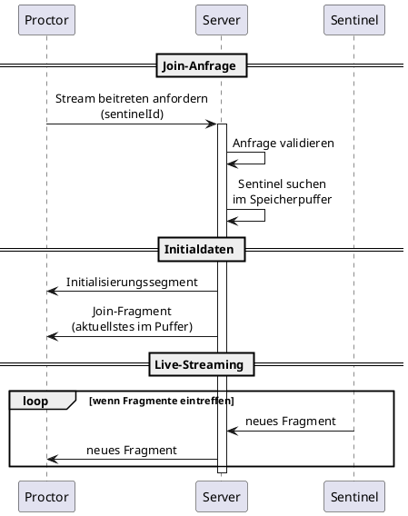
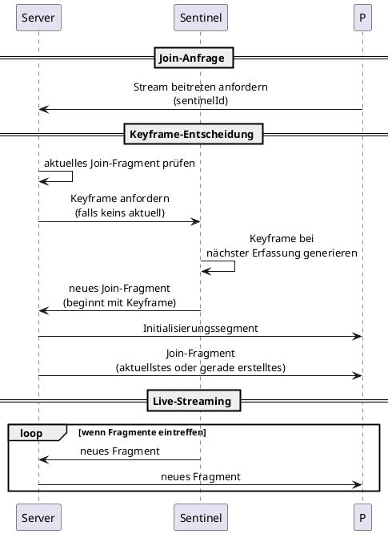

Dieses Dokument spezifiziert, wie ein Proctor dem Video-Stream eines Sentinels beitritt.

## Übersicht

Wenn ein Proctor den Bildschirm eines Sentinels betrachten möchte, muss er:

1. Dem Stream beitreten anfordern
2. Das Initialisierungssegment empfangen
3. Ein Join-Fragment empfangen (IDR-Einstiegspunkt)
4. Weiterhin Live-Fragmente empfangen

Siehe [Terminologie](../terminology) für den Unterschied zwischen Fragmenten (Live-Übertragungseinheiten) und Join-Fragmenten (Keyframe-Einstiegspunkte).

## Join-Ablaufdiagramm

## Schritt für Schritt

{}

### Proctor sendet Join-Anfrage

Der Proctor sendet eine Nachricht über WebSocket und fordert den Beitritt zum Stream eines bestimmten Sentinels an.

**Pflichtfelder:**

| Feld | Typ | Beschreibung |
|-------|------|-------------|
| `sentinelId` | string | Der Sentinel, dem beigetreten werden soll |

**Optionale Felder:**

| Feld | Typ | Beschreibung |
|-------|------|-------------|
| `startFrom` | string | `"oldest"` (Standard) oder `"latest"` |

### Server validiert und sucht

Der Server:
- Validiert, dass der Proctor berechtigt ist, den Sentinel zu sehen
- Prüft, ob der Sentinel aktuell streamt
- Sucht die Session-Daten im Speicher

Falls der Sentinel nicht streamt, antwortet der Server mit einem Fehler.

### Server sendet Initialisierungssegment

Der Server sendet das gecachte Initialisierungssegment für die aktuelle Session des Sentinels.

**Pflichtfelder:**

| Feld | Typ | Beschreibung |
|-------|------|-------------|
| `sentinelId` | string | Identifiziert den Stream |
| `sessionId` | string | Aktuelle Session-Kennung |
| `data` | bytes | Rohe fMP4-Initialisierungssegment-Bytes |

### Server sendet Join-Fragment

Der Server wählt ein Join-Fragment aus dem Speicherpuffer und sendet es.

**Auswahlstrategie:**

| `startFrom` | Ausgewähltes Join-Fragment |
|-------------|------------------|
| `"oldest"` | Ältestes Join-Fragment im Puffer (maximale Aufholzeit) |
| `"latest"` | Aktuellstes Join-Fragment (geringste Latenz) |

Das ausgewählte Fragment ist garantiert ein IDR-Keyframe (Join-Fragment).

**Pflichtfelder:**

| Feld | Typ | Beschreibung |
|-------|------|-------------|
| `sentinelId` | string | Identifiziert den Stream |
| `sequence` | integer | Fragment-Sequenznummer |
| `data` | bytes | Rohe fMP4-Fragment-Bytes (`moof` + `mdat`) |

### Server pusht weiterhin Fragmente

Ab diesem Punkt pusht der Server neue Fragmente an den Proctor, sobald diese vom Sentinel eintreffen.

{}

## Server-initiierter Keyframe für schnellen Beitritt

Wenn ein Proctor beitritt und kein aktuelles Join-Fragment im Puffer vorhanden ist, fordert der Server einen On-Demand-Keyframe vom Sentinel an.

Siehe [Steuernachrichten](../control-messages) für den Keyframe-Anfrage-Ablauf.

Mit einem server-initiierten Keyframe:

## Sofortige Vorschau (UX-Strategie)

Für Karussell-ähnliches Umschalten kann der Proctor dem nächsten Stream ~5 Sekunden früh beitreten, damit Video bereits fließt, bevor der Benutzer wechselt.

Dies ist nur eine UX-Optimierung. Es führt keine neuen Protokollnachrichten ein und ändert das Server-Verhalten nicht.

## Stream wechseln

Wenn ein Proctor von einem Sentinel zu einem anderen wechselt:

{}

### Aktuellen Stream abbestellen

Proctor benachrichtigt den Server, keine Fragmente mehr für den aktuellen Sentinel zu senden.

### Neuem Stream beitreten

Den Standard-Join-Ablauf für den neuen Sentinel befolgen.

### MSE-Puffer zurücksetzen

Im Browser muss der Proctor:
- Den vorhandenen `SourceBuffer` leeren
- Das neue Initialisierungssegment anhängen
- Fragmente aus dem neuen Stream anhängen

{}

## Fehlerbehandlung

| Bedingung | Server-Antwort |
|-----------|-----------------|
| Sentinel nicht gefunden | Fehler: unbekannter Sentinel |
| Sentinel streamt nicht | Fehler: Sentinel offline |
| Autorisierungsfehler | Fehler: nicht berechtigt |
| Kein Join-Fragment im Puffer | Initialisierungssegment senden, nächstes Join-Fragment anfordern/abwarten |

## Latenz-Überlegungen

| Faktor | Auswirkung auf Beitrittslatenz |
|--------|------------------------|
| Puffer enthält Join-Fragmente | Sofortiger Beitritt (aus Puffer senden) |
| Server fordert Keyframe an | Auf nächsten Erfassungszyklus warten |
| Kein Join-Fragment verfügbar | Bis zu maximalem Keyframe-Intervall (20–30 s), sofern kein Keyframe vom Server angefordert wird |

Für niedrigste Beitrittslatenz:
1. `startFrom: "latest"` verwenden
2. Aktuelle Join-Fragmente im Speicher halten


„20–30 Sekunden" ist das maximale Keyframe-Intervall (Join-Fragment-Abstand). Live-Video wird weiterhin kontinuierlich als Fragmente übertragen.

