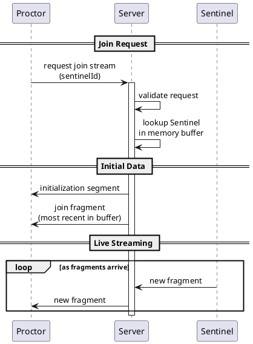
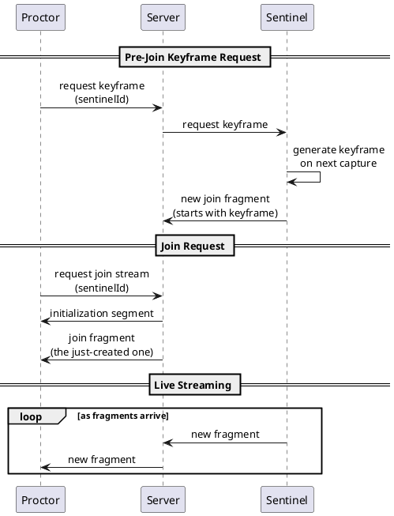

This document specifies how a Proctor joins a Sentinel's video stream.

## Overview

When a Proctor wants to view a Sentinel's screen, it must:

1. Request to join the stream
2. Receive the initialization segment
3. Receive a join fragment (IDR entry point)
4. Continue receiving live fragments

See [Terminology](../terminology) for the distinction between fragments (live delivery units) and join fragments (keyframe entry points).

## Join Flow Diagram

## Step-by-Step

{}

### Proctor Sends Join Request

The Proctor sends a message over WebSocket requesting to join a specific Sentinel's stream.

**Required fields:**

| Field | Type | Description |
|-------|------|-------------|
| `sentinelId` | string | The Sentinel to subscribe to |

**Optional fields:**

| Field | Type | Description |
|-------|------|-------------|
| `startFrom` | string | `"oldest"` (default) or `"latest"` |

### Server Validates and Looks Up

The Server:
- Validates the Proctor is authorized to view the Sentinel
- Checks if the Sentinel is currently streaming
- Locates the session data in memory

If the Sentinel is not streaming, the Server responds with an error.

### Server Sends Initialization Segment

The Server sends the cached initialization segment for the Sentinel's current session.

**Required fields:**

| Field | Type | Description |
|-------|------|-------------|
| `sentinelId` | string | Identifies the stream |
| `sessionId` | string | Current session identifier |
| `data` | bytes | Raw fMP4 initialization segment |

### Server Sends Join Fragment

The Server selects a join fragment from the memory buffer and sends it.

**Selection strategy:**

| `startFrom` | Join Fragment Selected |
|-------------|------------------|
| `"oldest"` | Oldest join fragment in buffer (maximum catch-up time) |
| `"latest"` | Most recent join fragment (lowest latency) |

The selected fragment is guaranteed to start with an IDR keyframe (join fragment).

**Required fields:**

| Field | Type | Description |
|-------|------|-------------|
| `sentinelId` | string | Identifies the stream |
| `sequence` | integer | Fragment sequence number |
| `data` | bytes | Raw fMP4 fragment (`moof` + `mdat`) |

### Server Continues Pushing Fragments

From this point, the Server pushes new fragments to the Proctor as they arrive from the Sentinel.

{}

## On-Demand Keyframe for Fast Join

If the Proctor wants to minimize join latency (not wait for the next join fragment), it can request an on-demand keyframe before or during the join.

See [Control Messages](../control-messages) for the keyframe request flow.

With on-demand keyframes:

## Predictive Pre-Fetching

Proctors may predict which Sentinel they will view next (e.g., based on UI layout or user behavior) and pre-fetch:

1. Request a keyframe for the predicted Sentinel
2. When ready to switch, join is near-instant

This is optional behavior implemented in the Proctor application.

## Switching Streams

When a Proctor switches from one Sentinel to another:

{}

### Unsubscribe from Current Stream

Proctor notifies Server to stop sending fragments for the current Sentinel.

### Join New Stream

Follow the standard join flow for the new Sentinel.

### Reset MSE Buffer

In the browser, the Proctor must:
- Clear the existing `SourceBuffer`
- Append the new initialization segment
- Begin appending fragments from the new stream

{}

## Error Handling

| Condition | Server Response |
|-----------|-----------------|
| Sentinel not found | Error: unknown Sentinel |
| Sentinel not streaming | Error: Sentinel offline |
| Authorization failure | Error: not authorized |
| No join fragment in buffer | Send initialization segment, request/await next join fragment |

## Latency Considerations

| Factor | Impact on Join Latency |
|--------|------------------------|
| Buffer has join fragments | Immediate join (send from buffer) |
| On-demand keyframe requested | Wait for next capture cycle |
| No join fragment available | Up to max keyframe interval (20-30s) unless on-demand keyframe is used |

For lowest latency joins:
1. Use on-demand keyframe requests
2. Use `startFrom: "latest"` 
3. Pre-fetch keyframes for likely next streams


"20-30 seconds" is the maximum keyframe interval (join fragment spacing). Live video is still delivered continuously as fragments.

