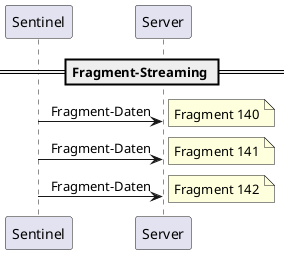
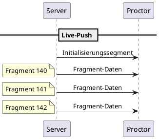

Dieses Dokument spezifiziert, wie Videodaten zwischen den Komponenten transportiert werden.

## Übersicht

| Anwendungsfall | Protokoll | Richtung |
|----------|----------|-----------|
| Live-Streaming | WebSocket | Server → Proctor (Push) |
| Live-Streaming | WebSocket | Sentinel → Server (Push) |
| Historische Wiedergabe | HTTP | Proctor → Server (Pull) |
| Steuernachrichten | WebSocket | Bidirektional |

## WebSocket: Live-Streaming

Alle Live-Videodaten fließen über WebSocket-Verbindungen.

### Sentinel → Server

Der Sentinel pusht **Fragmente** an den Server, sobald sie finalisiert sind.

Siehe [Terminologie](../terminology) für den Unterschied zwischen Fragmenten (Live-Übertragungseinheiten) und Keyframes (Join-Punkte).

### Server → Proctor

Der Server pusht Fragmente an abonnierte Proctors, sobald sie eintreffen.

### Datenformat

Die Spezifikation schreibt kein bestimmtes Serialisierungsformat für WebSocket-Nachrichten vor. Implementierungen können verwenden:

- JSON mit base64-kodierten Binärdaten
- Binäre WebSocket-Frames mit Header
- Protocol Buffers
- Andere Formate

Die Kernanforderung ist, dass die Nachricht enthält:

 | Feld | Typ | Beschreibung |
 |-------|------|-------------|
 | `sentinelId` | string | Identifiziert, zu welchem Sentinel dieses Fragment gehört |
 | `sequence` | integer | Fragment-Sequenznummer |
 | `data` | bytes | Rohe fMP4-Fragment-Bytes (`moof` + `mdat`) |

Zusätzliche Metadaten (Bildrate, Zeitstempel) können enthalten oder aus den Fragment-Bytes abgeleitet werden.

### Initialisierungssegment

Das Initialisierungssegment wird separat gesendet, typischerweise:

- Einmal wenn ein Proctor einem Stream beitritt
- Auf Anfrage (siehe [Steuernachrichten](../control-messages))

| Feld | Typ | Beschreibung |
|-------|------|-------------|
| `sentinelId` | string | Identifiziert welchen Sentinel |
| `data` | bytes | Rohe fMP4-Initialisierungssegment-Bytes |

## HTTP: Historische Wiedergabe

Für den Zugriff auf Fragmente, die aus dem Speicherpuffer ausgelaufen sind, verwenden Proctors HTTP.

### Benötigte Informationen

Um ein historisches Fragment abzurufen, benötigt der Proctor:

| Information | Beschreibung |
|-------------|-------------|
| `sentinelId` | Stream welches Sentinels |
| `sessionId` | Welche Session |
 | `sequence` | Welches Fragment (oder Bereich) |

### Antwort

Die HTTP-Antwort enthält die rohen fMP4-Fragment-Bytes mit entsprechenden Content-Headern.

| Header | Wert |
|--------|-------|
| `Content-Type` | `video/mp4` |
| `Content-Length` | Größe in Bytes |

### Verfügbare Fragmente auflisten

Proctors müssen möglicherweise abfragen, welche Fragmente für eine Session verfügbar sind. Die Antwort sollte enthalten:

 | Feld | Typ | Beschreibung |
 |-------|------|-------------|
 | `sentinelId` | string | Sentinel-Kennung |
 | `sessionId` | string | Session-Kennung |
 | `fragments` | array | Liste der verfügbaren Fragment-Metadaten |

Jeder Eintrag:

| Feld | Typ | Beschreibung |
|-------|------|-------------|
 | `sequence` | integer | Fragment-Nummer |
 | `startTime` | timestamp | Wann das Fragment beginnt |
 | `duration` | integer | Dauer in Millisekunden |


Die genaue HTTP-Endpunktstruktur ist implementierungsdefiniert. Die Spezifikation definiert nur, welche Informationen verfügbar sein müssen.


## Protokollauswahl

### Wann WebSocket verwenden

| Szenario | WebSocket verwenden |
|----------|---------------|
| Live-Stream-Ansicht | Ja |
 | Einem Stream beitreten | Ja (Init + aktuelle Fragmente holen) |
 | Steuernachrichten (Keyframe-Anfrage, FPS-Änderung) | Ja |
 | Echtzeit-Fragment-Push vom Sentinel | Ja |

### Wann HTTP verwenden

 | Szenario | HTTP verwenden |
 |----------|----------|
 | Fragmente abrufen, die älter als das Pufferfenster sind | Ja |
 | Verfügbare Sessions/Fragmente abfragen | Ja |
 | Für Export/Archivierung herunterladen | Ja |

## Verbindungslebenszyklus

### Sentinel-Verbindung

1. Sentinel stellt WebSocket-Verbindung zum Server her
2. Sentinel sendet Registrierung/Identifikation
3. Sentinel beginnt mit dem Pushen von Fragmenten
4. Verbindung bleibt für die Session-Dauer offen
5. Bei Trennung endet die Session

### Proctor-Verbindung

1. Proctor stellt WebSocket-Verbindung zum Server her
2. Proctor sendet Registrierung/Identifikation
3. Proctor abonniert einen oder mehrere Sentinel-Streams
4. Server pusht Fragmente für abonnierte Streams
5. Proctor kann Abonnements während der Session wechseln
6. Verbindung bleibt offen, solange Proctor aktiv ist

## Bandbreiten-Überlegungen

Da Sentinel und Server voraussichtlich im selben LAN sind:

- Bandbreite ist keine primäre Einschränkung
- Einzelframe-Nachrichten sind akzeptabel
- Kein Bedarf für aggressives Batching oder Kompression über H.264 hinaus

Für Proctor-Verbindungen (potenziell über WAN):

- Der Speicherpuffer (15–20 Sekunden) bietet Aufholkapazität
- Proctors mit langsamen Verbindungen können zurückfallen
- Bei mehr Rückstand als das Pufferfenster muss der Proctor vorspringen oder HTTP für historisches Aufholen verwenden
