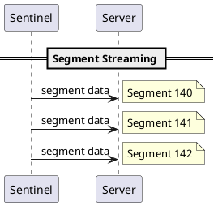
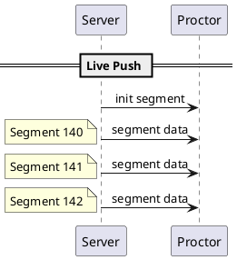

This document specifies how video data is transported between components.

## Overview

| Use Case | Protocol | Direction |
|----------|----------|-----------|
| Live streaming | WebSocket | Server → Proctor (push) |
| Live streaming | WebSocket | Sentinel → Server (push) |
| Historical playback | HTTP | Proctor → Server (pull) |
| Control messages | WebSocket | Bidirectional |

## WebSocket: Live Streaming

All live video data flows over WebSocket connections.

### Sentinel → Server

The Sentinel pushes segments to the Server as they are created.

### Server → Proctor

The Server pushes segments to subscribed Proctors as they arrive.

### Data Format

The spec does not mandate a specific serialization format for WebSocket messages. Implementations may use:

- JSON with base64-encoded binary data
- Binary WebSocket frames with a header
- Protocol Buffers
- Other formats

The key requirement is that the message contains:

| Field | Type | Description |
|-------|------|-------------|
| `sentinelId` | string | Identifies which Sentinel this segment belongs to |
| `sequence` | integer | Segment sequence number |
| `data` | bytes | Raw fMP4 segment bytes |

Additional metadata (framerate, timestamp) may be included or derived from the segment bytes.

### Initialization Segment

The initialization segment is sent separately, typically:

- Once when a Proctor joins a stream
- On request (see [Control Messages](../control-messages))

| Field | Type | Description |
|-------|------|-------------|
| `sentinelId` | string | Identifies which Sentinel |
| `data` | bytes | Raw fMP4 initialization segment bytes |

## HTTP: Historical Playback

For accessing segments that have aged out of the memory buffer, Proctors use HTTP.

### Required Information

To fetch a historical segment, the Proctor needs:

| Information | Description |
|-------------|-------------|
| `sentinelId` | Which Sentinel's stream |
| `sessionId` | Which session |
| `sequence` | Which segment (or range) |

### Response

The HTTP response contains the raw fMP4 segment bytes with appropriate content headers.

| Header | Value |
|--------|-------|
| `Content-Type` | `video/mp4` |
| `Content-Length` | Size in bytes |

### Listing Available Segments

Proctors may need to query which segments are available for a session. The response should include:

| Field | Type | Description |
|-------|------|-------------|
| `sentinelId` | string | Sentinel identifier |
| `sessionId` | string | Session identifier |
| `segments` | array | List of available segment metadata |

Each segment entry:

| Field | Type | Description |
|-------|------|-------------|
| `sequence` | integer | Segment number |
| `startTime` | timestamp | When the segment starts |
| `duration` | integer | Duration in milliseconds |


The exact HTTP endpoint structure is implementation-defined. The spec only defines what information must be available.


## Protocol Selection

### When to Use WebSocket

| Scenario | Use WebSocket |
|----------|---------------|
| Live stream viewing | Yes |
| Joining a stream | Yes (get init + recent segments) |
| Control messages (keyframe request, FPS change) | Yes |
| Real-time segment push from Sentinel | Yes |

### When to Use HTTP

| Scenario | Use HTTP |
|----------|----------|
| Fetching segments older than buffer window | Yes |
| Querying available sessions/segments | Yes |
| Downloading for export/archival | Yes |

## Connection Lifecycle

### Sentinel Connection

1. Sentinel establishes WebSocket connection to Server
2. Sentinel sends registration/identification
3. Sentinel begins pushing segments
4. Connection remains open for session duration
5. On disconnect, session ends

### Proctor Connection

1. Proctor establishes WebSocket connection to Server
2. Proctor sends registration/identification
3. Proctor subscribes to one or more Sentinel streams
4. Server pushes segments for subscribed streams
5. Proctor may switch subscriptions during session
6. Connection remains open while Proctor is active

## Bandwidth Considerations

Since Sentinel and Server are expected to be on the same LAN:

- Bandwidth is not a primary constraint
- Single-frame messages are acceptable
- No need for aggressive batching or compression beyond H.264

For Proctor connections (potentially over WAN):

- The memory buffer (15-20 seconds) provides catch-up capacity
- Proctors with slow connections may fall behind
- If behind by more than buffer window, Proctor must skip forward or use HTTP for historical catch-up
