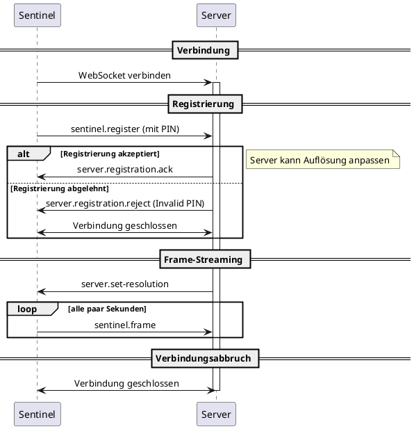
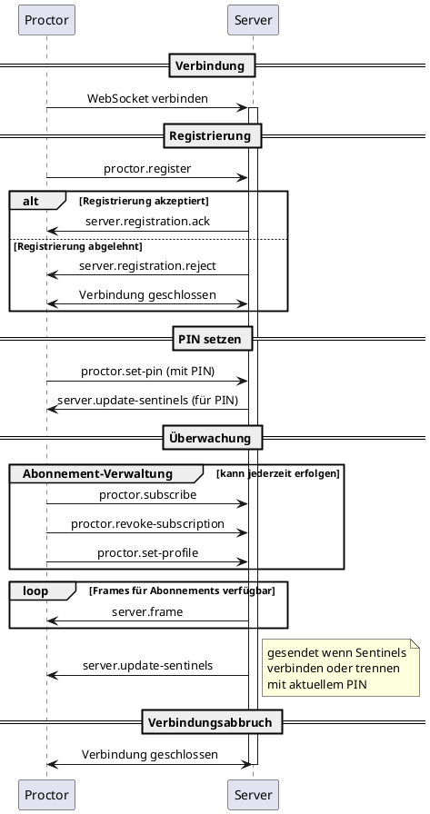

Dieses Dokument beschreibt den Lebenszyklus der WebSocket-Verbindungen für Sentinels und Proctors.

- **Sentinel**: Frame-Produzent (läuft auf Schülerrechnern)
- **Proctor**: Frame-Konsument (Lehrer-Interface)

---

## Sentinel-Lebenszyklus

### Ablauf

1. Verbindung zum Server via WebSocket herstellen
2. `sentinel.register` als erste Nachricht mit PIN-Code (1337–4200) und `auth`-Token senden
3. `server.registration.ack` oder `server.registration.reject` empfangen
   - Bei Ablehnung wegen ungültigem PIN lautet der Grund „Invalid PIN"
   - Bei Ablehnung wegen ungültigem Auth oder ungültiger Nachricht wird die Verbindung geschlossen oder abgelehnt
4. Bei Annahme: `server.set-resolution` empfangen, wenn der Server die Erfassungsauflösung aktualisiert
5. `sentinel.frame` alle paar Sekunden senden
6. Verbindung schließt, wenn der Sentinel herunterfährt

### Sequenzdiagramm

---

## Proctor-Lebenszyklus

### Ablauf

1. Verbindung zum Server via WebSocket herstellen
2. `proctor.register` als erste Nachricht mit einem `auth`-Token senden
3. `server.registration.ack` oder `server.registration.reject` empfangen
   - Bei Ablehnung wegen ungültigem Auth oder ungültiger Nachricht wird die Verbindung geschlossen oder abgelehnt
4. Bei Annahme:
    - `proctor.set-pin` senden, um anzugeben, welche Sentinels des PINs überwacht werden sollen (1337–4200)
    - `server.update-sentinels` mit der Liste der verfügbaren Sentinels für diesen PIN empfangen
    - `proctor.subscribe` oder `proctor.revoke-subscription` nach Bedarf senden
    - `proctor.set-profile` senden, um `HIGH`, `MEDIUM` oder `LOW` anzufordern
    - `server.frame` für abonnierte Sentinels empfangen
5. Verbindung schließt, wenn der Proctor herunterfährt

### Sentinel-Updates

Der Server sendet `server.update-sentinels` an den Proctor:

- Unmittelbar nach erfolgreicher Registrierung
- Wann immer ein Sentinel verbindet oder trennt
- Wenn der Proctor seinen PIN aktualisiert

### Sequenzdiagramm

