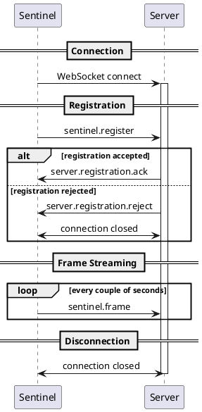
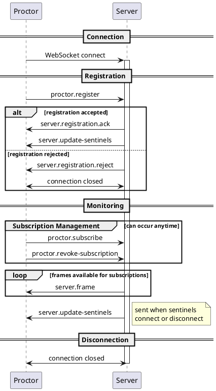

This document describes the lifecycle of WebSocket connections for both Sentinels and Proctors.

- **Sentinel**: Frame producer (runs on student machines)
- **Proctor**: Frame consumer (teacher interface)

---

## Sentinel Lifecycle

### Flow

1. Connect to server via WebSocket
2. Send `sentinel.register` as the first message
3. Receive `server.registration.ack` or `server.registration.reject`
4. If accepted: send `sentinel.frame` every couple of seconds
5. Connection closes when the sentinel shuts down

### Sequence Diagram

---

## Proctor Lifecycle

### Flow

1. Connect to server via WebSocket
2. Send `proctor.register` as the first message
3. Receive `server.registration.ack` or `server.registration.reject`
4. If accepted:
   - Receive `server.update-sentinels` with the list of available sentinels
   - Send `proctor.subscribe` or `proctor.revoke-subscription` as needed
   - Receive `server.frame` for subscribed sentinels
5. Connection closes when the proctor shuts down

### Sentinel Updates

The server sends `server.update-sentinels` to the proctor:

- Immediately after successful registration
- Whenever a sentinel connects or disconnects

### Sequence Diagram

