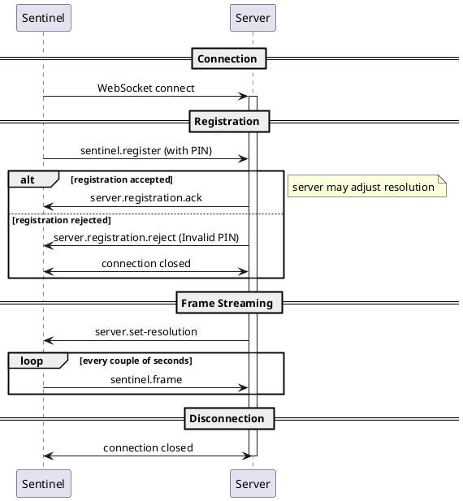
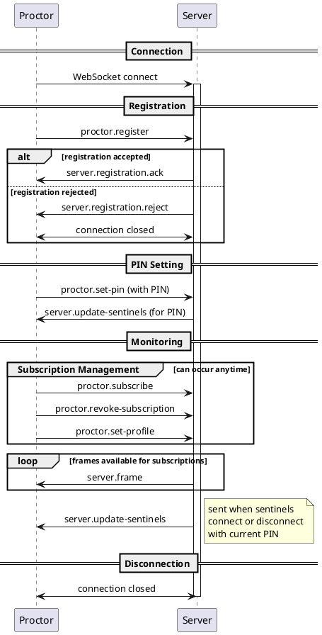

This document describes the lifecycle of WebSocket connections for both Sentinels and Proctors.

- **Sentinel**: Frame producer (runs on student machines)
- **Proctor**: Frame consumer (teacher interface)

---

## Sentinel Lifecycle

### Flow

1. Connect to server via WebSocket with `Authorization: Bearer <jwt>` header
2. Send `sentinel.register` as the first message with PIN code (1337-4200)
3. Receive `server.registration.ack` or `server.registration.reject`
   - If rejected due to invalid PIN, the reason will be "Invalid PIN"
4. If accepted: receive `server.set-resolution` when the server updates the
   capture resolution
5. Send `sentinel.frame` every couple of seconds
6. Connection closes when the sentinel shuts down

### Sequence Diagram

```plantuml
@startuml
skinparam sequenceMessageAlign center

participant "Sentinel" as S
participant "Server" as Srv

== Connection ==
S -> Srv : WebSocket connect
activate Srv

== Registration ==
S -> Srv : sentinel.register (with PIN)
alt registration accepted
  Srv -> S : server.registration.ack
else registration rejected
  Srv -> S : server.registration.reject (Invalid PIN)
  S <-> Srv : connection closed
end

== Frame Streaming ==
note right : server may adjust resolution
Srv -> S : server.set-resolution
loop every couple of seconds
  S -> Srv : sentinel.frame
end

== Disconnection ==
S <-> Srv : connection closed
deactivate Srv

@enduml
```

---

## Proctor Lifecycle

### Flow

1. Connect to server via WebSocket with `Authorization: Bearer <jwt>` header
2. Send `proctor.register` as the first message
3. Receive `server.registration.ack` or `server.registration.reject`
4. If accepted:
    - Send `proctor.set-pin` to specify which PIN's sentinels to monitor (1337-4200)
    - Receive `server.update-sentinels` with the list of available sentinels for that PIN
    - Send `proctor.subscribe` or `proctor.revoke-subscription` as needed
    - Send `proctor.set-profile` to request `HIGH`, `MEDIUM`, or `LOW`
    - Receive `server.frame` for subscribed sentinels
5. Connection closes when the proctor shuts down

### Sentinel Updates

The server sends `server.update-sentinels` to the proctor:

- Immediately after successful registration
- Whenever a sentinel connects or disconnects
- When the Proctor updates their pin

### Sequence Diagram

```plantuml
@startuml
skinparam sequenceMessageAlign center

participant "Proctor" as P
participant "Server" as Srv

== Connection ==
P -> Srv : WebSocket connect
activate Srv

== Registration ==
P -> Srv : proctor.register
alt registration accepted
  Srv -> P : server.registration.ack
else registration rejected
  Srv -> P : server.registration.reject
  P <-> Srv : connection closed
end

== PIN Setting ==
P -> Srv : proctor.set-pin (with PIN)
Srv -> P : server.update-sentinels (for PIN)

== Monitoring ==

group Subscription Management [can occur anytime]
   P -> Srv : proctor.subscribe
   P -> Srv : proctor.revoke-subscription
   P -> Srv : proctor.set-profile
end

loop frames available for subscriptions
   Srv -> P : server.frame
end

Srv -> P : server.update-sentinels
note right : sent when sentinels\nconnect or disconnect\nwith current PIN

== Disconnection ==
P <-> Srv : connection closed
deactivate Srv

@enduml
```
