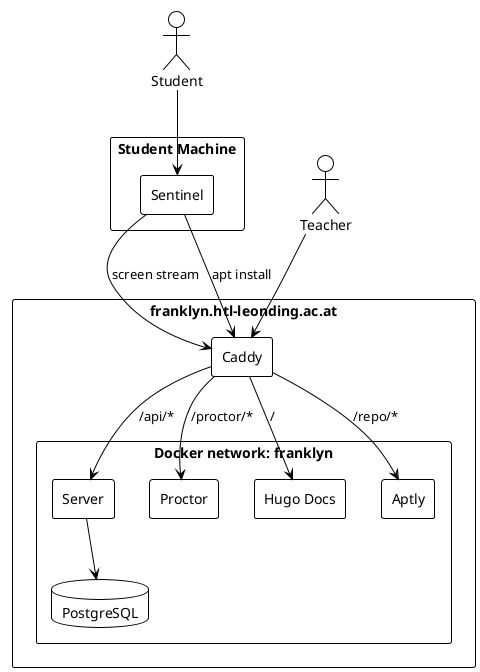

```plantuml
@startuml
!theme plain
skinparam componentStyle rectangle

actor "Student" as Student
actor "Teacher" as Teacher

rectangle "Student Machine" as StudentMachine {
    component "Sentinel" as Sentinel
}

rectangle "franklyn.htl-leonding.ac.at" as ServerHost {
    component "Caddy" as Caddy

    rectangle "Docker network: franklyn" as DockerNet {
        component "Server" as Server
        component "Proctor" as Proctor
        component "Hugo Docs" as Hugo
        component "Aptly" as Aptly
        database "PostgreSQL" as DB
    }
}

Student --> Sentinel
Sentinel --> Caddy : screen stream
Sentinel --> Caddy : apt install
Teacher --> Caddy
Caddy --> Server : "/api/*"
Caddy --> Proctor : "/proctor/*"
Caddy --> Hugo : /
Caddy --> Aptly : "/repo/*"
Server --> DB

@enduml
```
