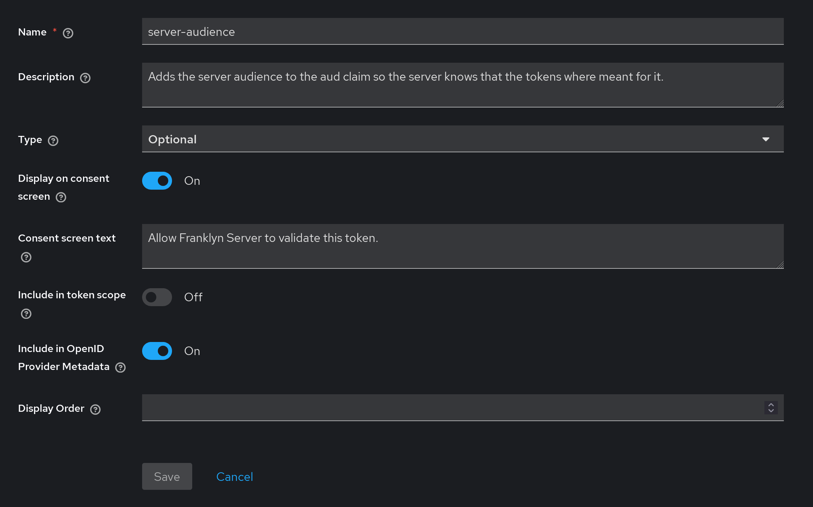
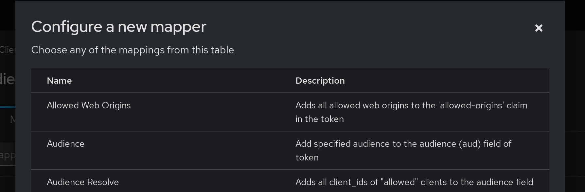
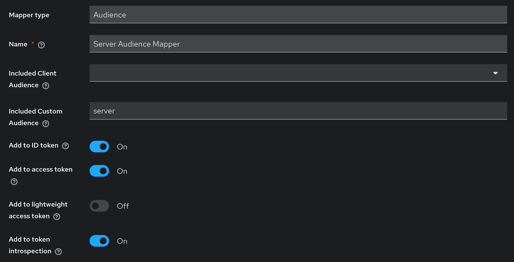
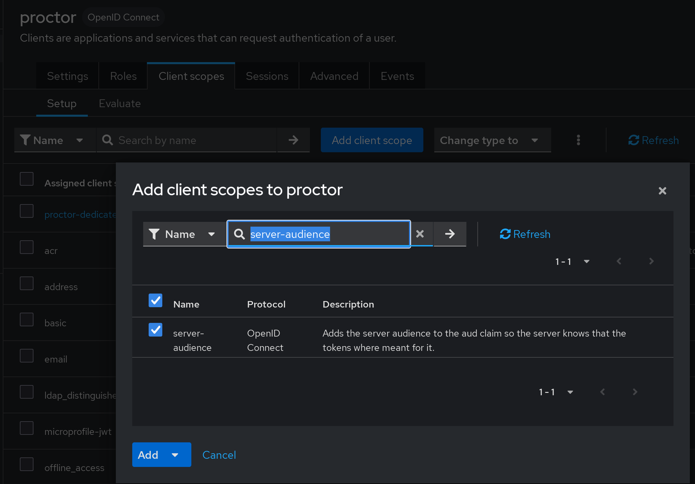

## AUD Client Mapper

In order for the server to understand, that an Authorization token issued by
sentinel or proctor, the clients have to add the server to the `aud` claim of
the token.

First create a client scope and name it `server-audience` and set it up like in
the screenshot.

Then go to the Mappers tab of the client scope and add a new custom Mapper and
choose Audience.

Set it up as shown in the screenshot and save it.

Assign this client scope as `Default` to proctor and sentinel.

