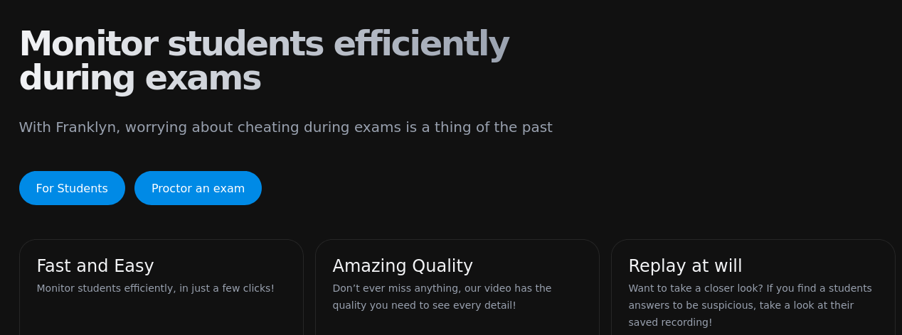
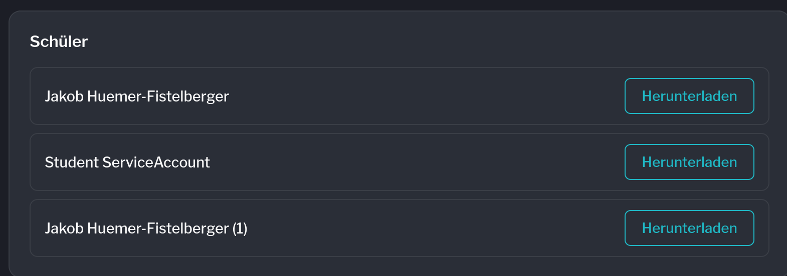
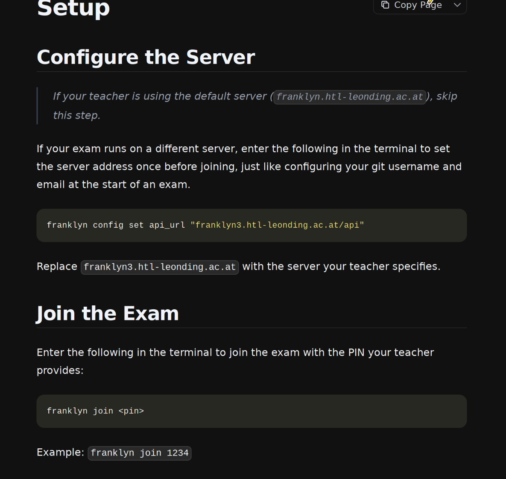
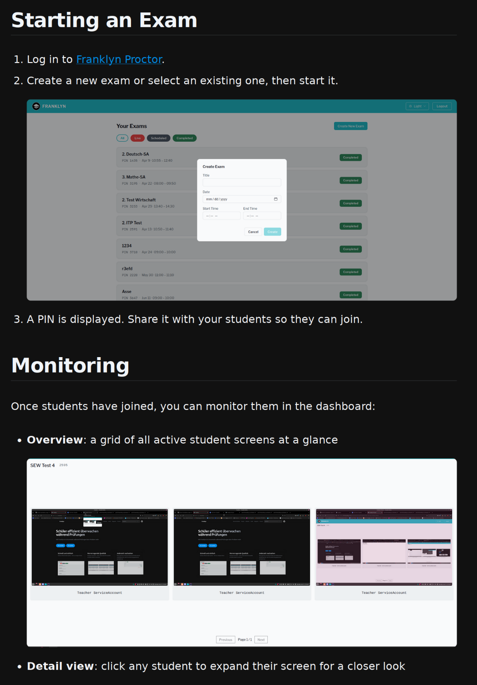
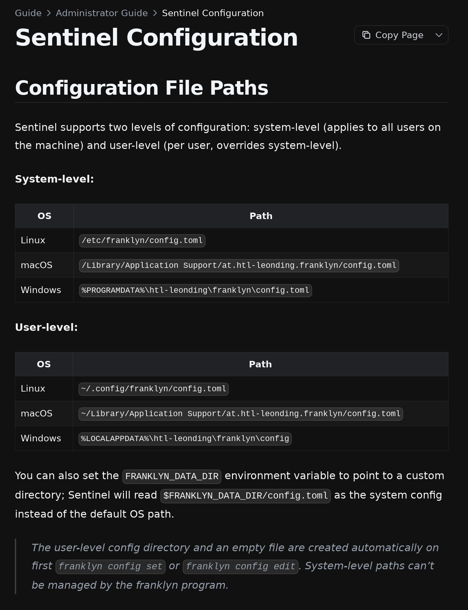
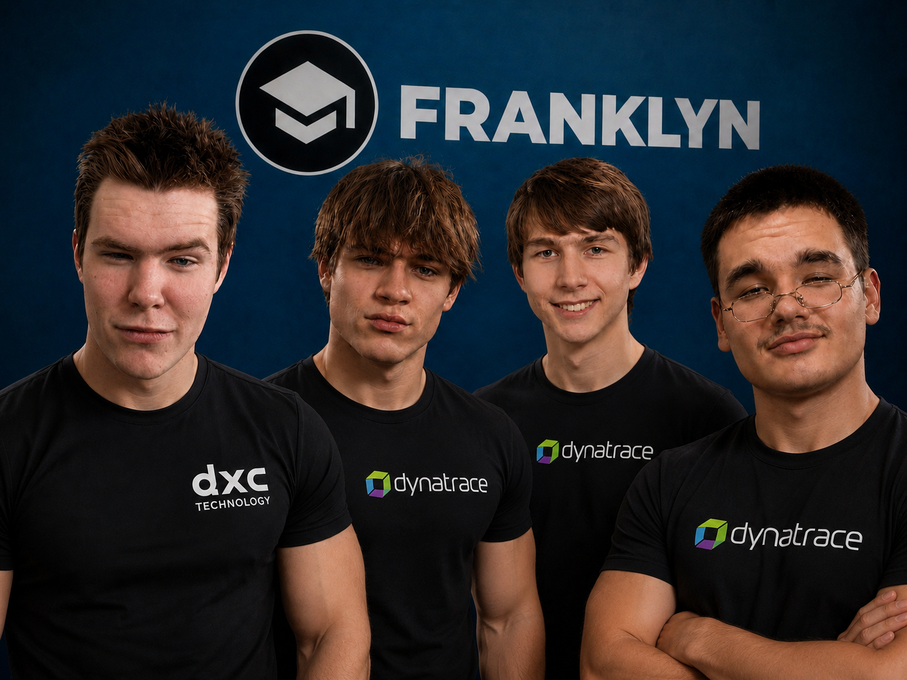



---

## What Franklyn Does

{}

Students join an exam with a **4-digit pin** — their screen is streamed live.

The teacher watches **all screens in a grid** or zooms into a **single screen**.

Every session is **recorded** and can be reviewed or downloaded after the exam.

{}

---

## How an Exam Runs

{}

**1. Create** — teacher creates an exam, server generates a pin.

**2. Join** — student runs `franklyn join <pin>`, Sentinel starts capturing.

**3. Monitor** — teacher watches the grid, zooms into any student.

**4. End** — exam closes, streams stop, recordings are finalized.

**5. Review** — teacher replays or downloads the videos.

{}

---

## Architecture

{}

{}

---

## Proctor

{}



{}

<p style="text-align: center; width: 100%">Vue 3 · GraphQL + WebSocket · Keycloak login · German and English · light/dark theme</p>

---

## Sentinel

{}
<div style="padding-bottom: 2rem">

```shell
franklyn join <pin>
franklyn config set api_url "franklyn3.htl-leonding.ac.at/api"
```

</div>

<div style="padding-bottom: 2rem">

Rust + GStreamer · **X11 and Wayland** (XDG desktop portal)

</div>

<div>

Layered config: **system → user → environment**

</div>

{}

---

## Streaming Pipeline

<div style="font-size: 1.6rem">

- **H.264** encoded on the student device, no transcoding on the server
- Packed as **fragmented MP4** — plays natively in the browser via MSE
- Transported over **WebSocket** with **protobuf** messages
- Adaptive rate: from 0.2 fps idle up to 30 fps at 1080p

</div>

---

## Recordings

{}



{}

<p style="text-align: center; width: 100%">Stored per session · bulk download after the exam · auto-deleted 30 days after exam end</p>

---

## Operations

<div style="font-size: 1.6rem">

- **Nix flake** as the single source of truth for dev shells, CI and builds
- Path-filtered **PR checks** per component, Codecov on the server
- Deployment via **Docker Compose** behind Caddy, with PostgreSQL
- Packaging: **openSUSE Build Service** (rpm), aptly (deb), Windows installer
- **GlitchTip / Sentry** error monitoring in Proctor and Sentinel

</div>

---

## Documentation

<div style="display: flex; gap: 1.5vw; justify-content: center; align-items: flex-start; margin-top: 2vh;">
  
  
  
</div>

<p style="text-align: center; width: 100%">Guides for students, teachers, administrators and self-hosting · Diátaxis-structured developer docs · protocol and media specs</p>

---

## By the Numbers









---

{}



{}
