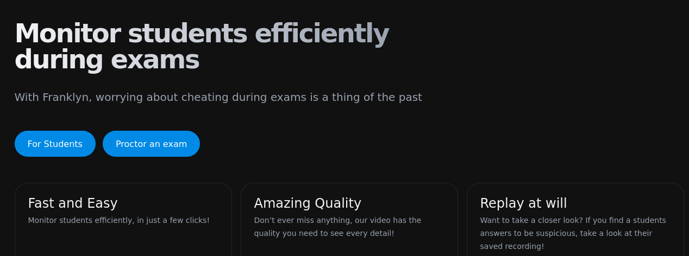
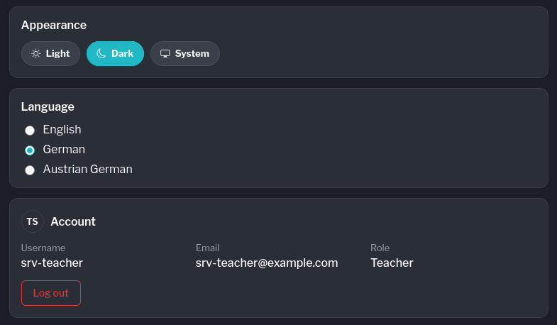



---

## Stats










---

## User Story



**As a** Teacher\
**I want** to use Franklyn during an exam\
**So that** I can provide an isolated environment.

<ul style="font-size: 1.6rem">
  <li style="font-size: inherit">Easy installation/use of Franklyn Sentinel {}</li>
  <li style="font-size: inherit">Tell teachers how to use Proctor or where to proctor on front page</li>
  <li style="font-size: inherit">FSD Up to date.</li>
</ul>

---

## Documentation

{}

**Deutliche Buttons**
 

[Student Installation Guide](https://franklyn.htl-leonding.ac.at/guide/students/)

[Teacher Proctor Guide](https://franklyn.htl-leonding.ac.at/guide/teachers/)
{}

---

## Organisatorisches

{}
**Latest** (v0.7.0) bekommt neue features. `main`

**LTS** Line (v0.6.x) bleibt stabil. `release/0.6.x`
{}

---

## Notice Banners

{}
Bieten eine Möglichkeit, um Lehrer aus sicht eines Admins zu informieren.

**3 Typen:**

- Alarm (rot, permanent)
- Zeitbasiert
- Einmalig

{}

---

## Settings

{}
Jeder Lehrer kann persönliche settings wie **Sprache** und **Theme** einstellen.

Eigene infos wie **Email**, **Name** und **Rolle** können eingesehen werden.

{}

---

{}

{}
