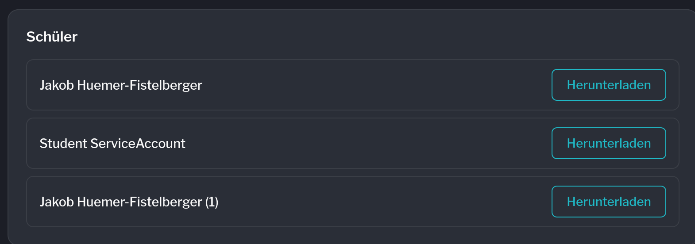
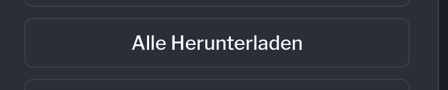
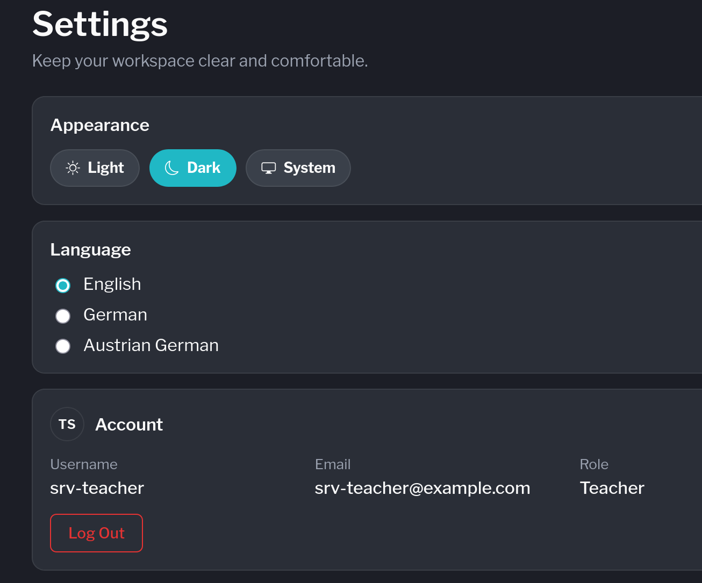
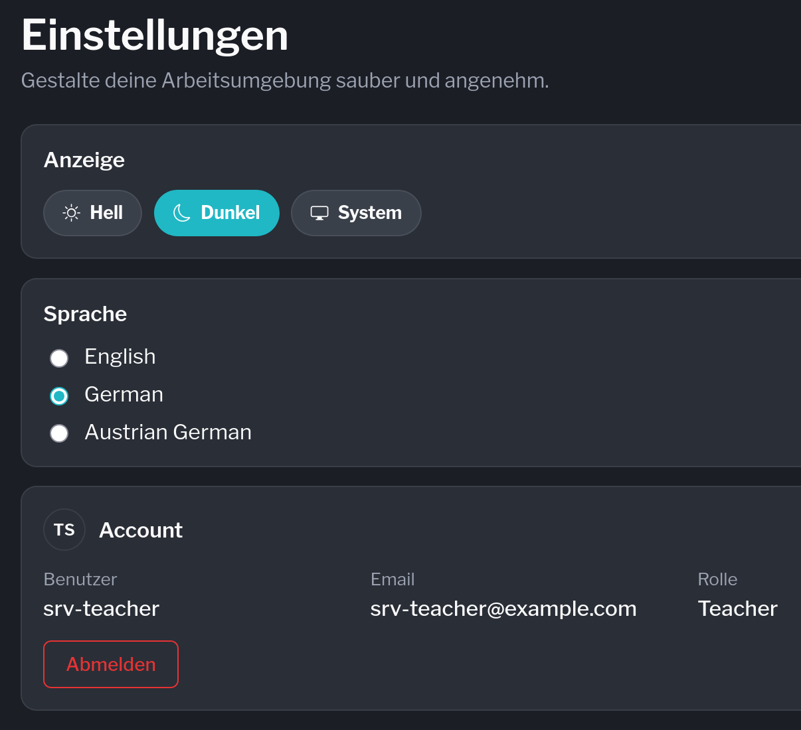
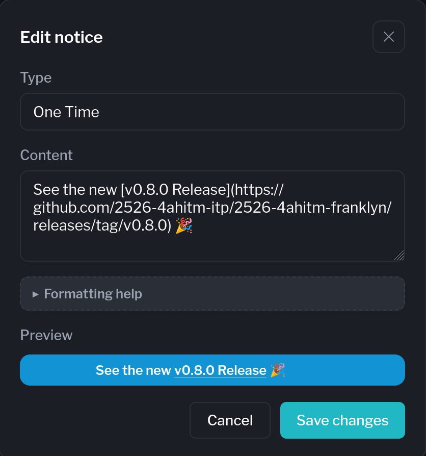



---

## User Story



**As a** Teacher\
**I want** to view the screen recording of a student after an exam\
**So that** I can check something after the exam.

<ul style="font-size: 1.6rem">
  <li style="font-size: inherit"> The entire session of the student is available as a video after completion
{}</li>
  <li style="font-size: inherit">The teacher can download the video per student. 
{}</li>
  <li style="font-size: inherit">An option to download all students videos at once. {}</li>
</ul>

---

## Video Download

---

## Internationalization

{}

Sprachen im Proctor:
- Deutsch
- English













{}

---

## Notice Banners




{}
Notice Banners unterstützen jetzt auch Markdown

- **bold**
- *italic*
- ~~strikethrough~~
- inline `code`
- [link](https://youtube.com)

{}



{}

{}




---

## Stats










---

{}

{}
