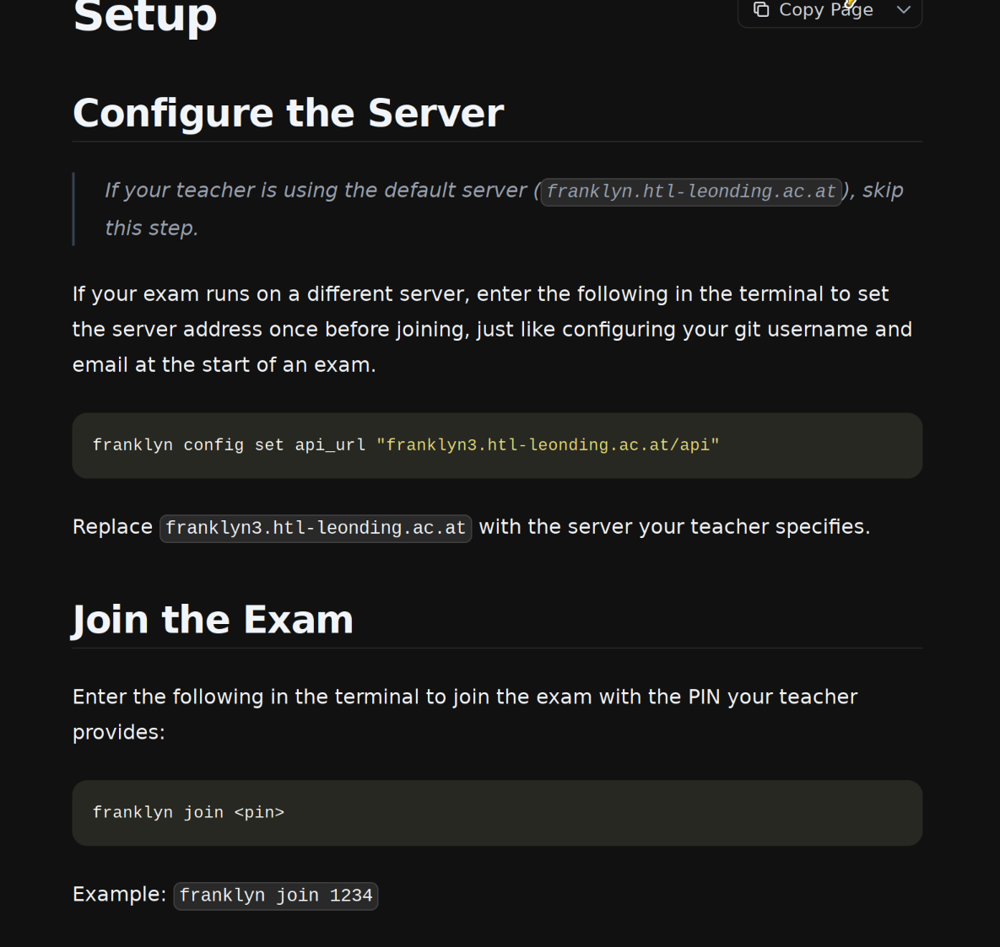
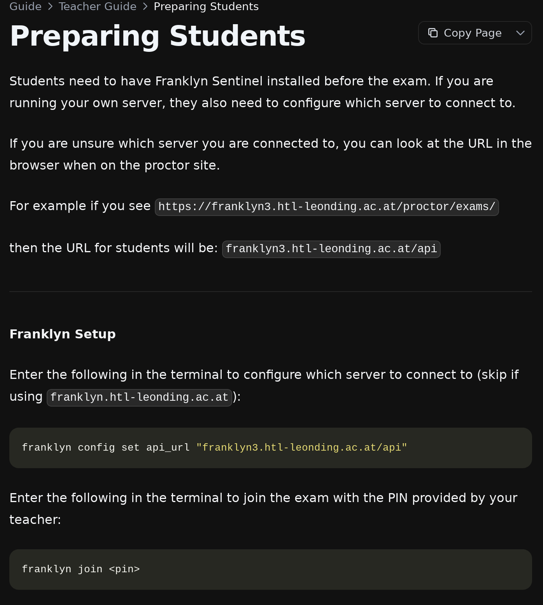
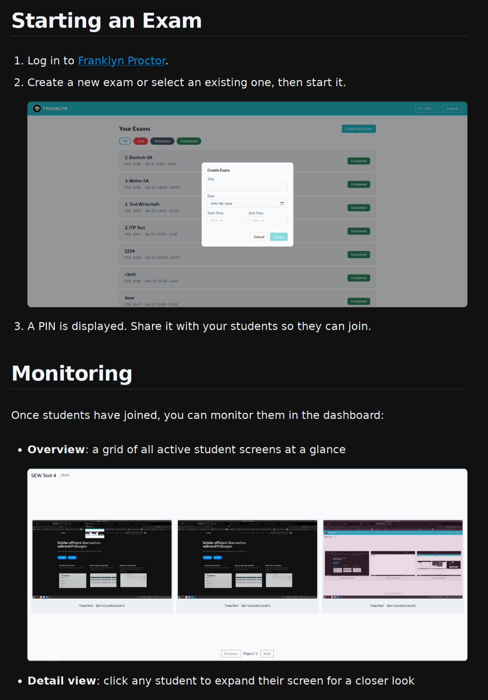
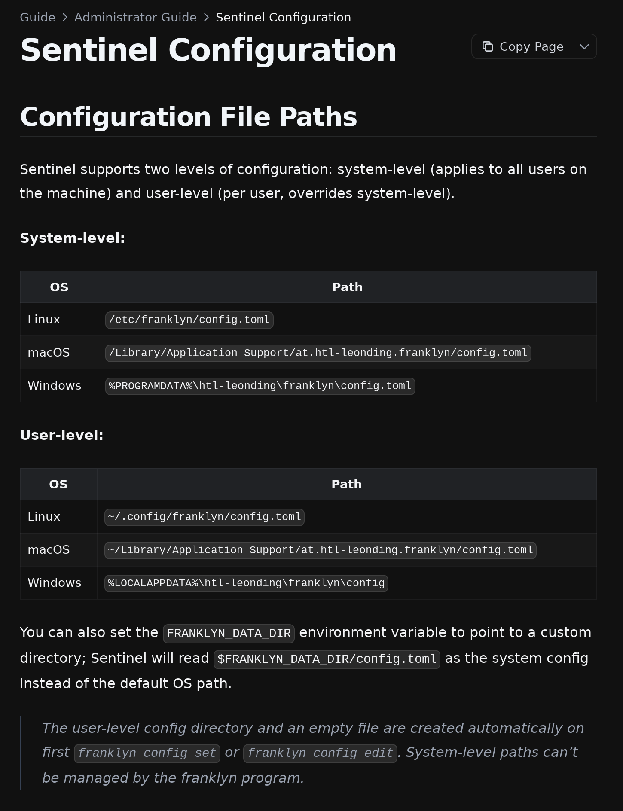



---

## Neues Franklyn Sentinel CLI

{}
<div style="padding-bottom: 3rem">

**Test beitreten:**

```shell
franklyn join <pin>
```

</div>

<div style="padding-bottom: 3rem">

**Server ändern:**

```shell
franklyn config set api_url "franklyn3.htl-leonding.ac.at/api"
```

</div>

<div>

**Konfiguration editieren:**

```shell
franklyn config edit  # öffnet $HOME/.config/franklyn/config.toml
```

</div>

{}

---

## Configuration

{}

{}

---

## Guides

<div style="display: flex; gap: 1.5vw; justify-content: center; align-items: flex-start; margin-top: 2vh;">
  
  
  
  
</div>

<p style="text-align: center; margin-top: 1.5vh;"><a href="/guide">franklyn.htl-leonding.ac.at/guide</a></p>

---

## Stats










---

{}


{}
