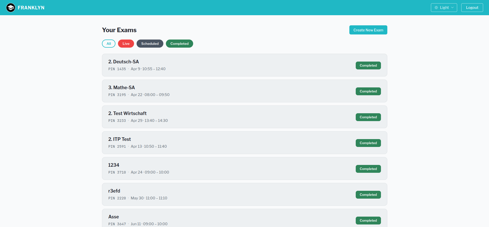
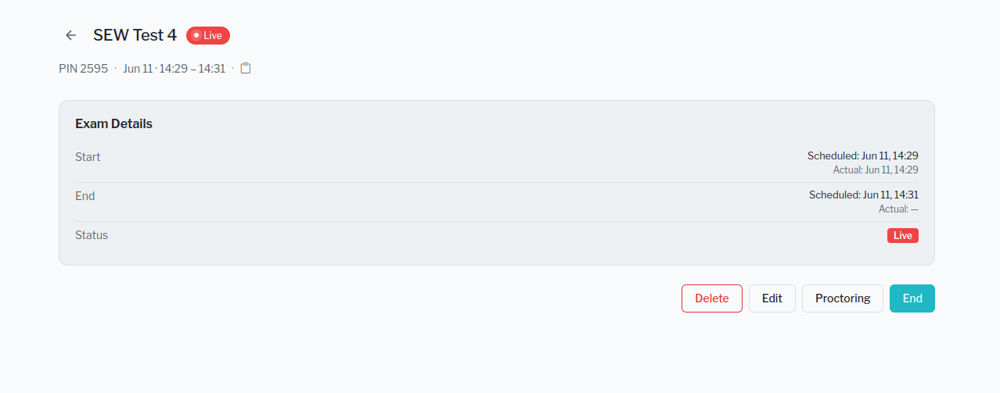
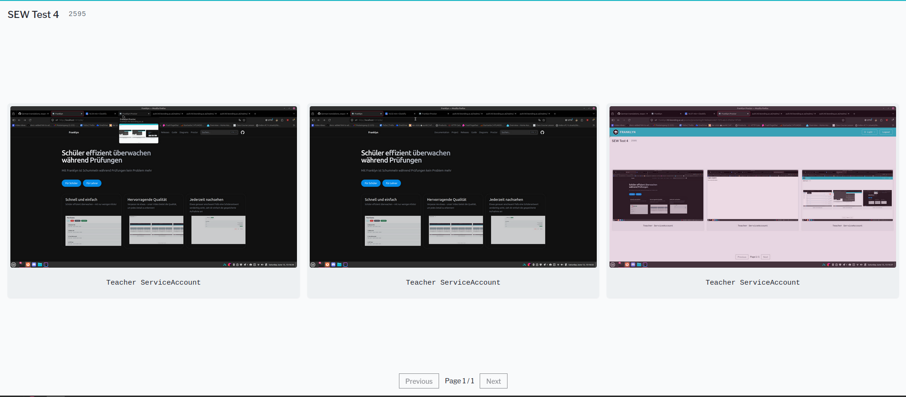
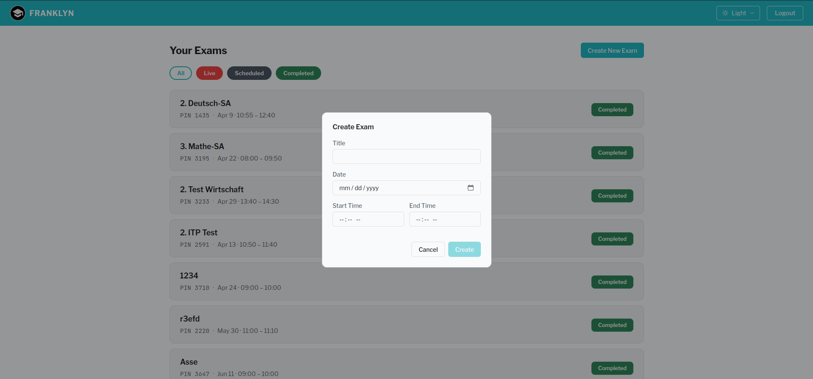
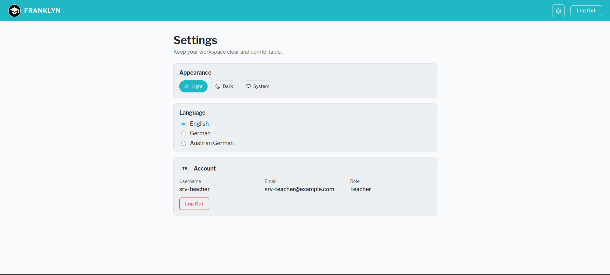

# Nutzung von Proctor

Nach der Anmeldung siehst du eine Übersicht aller laufenden, abgeschlossenen und zukünftigen Tests.

## Einen Test überwachen

Um einen Test zu überwachen klickst du auf den gewollten Test (dieser muss live oder zukünftig sein) und unten rechts auf den Knopf "Überwachung".

von dort aus siehst du alle Bildschirme der aktuellen Teilnehmenden.

## Einen Test erstellen

Um einen Test zu erstellen musst du von der Start Seite aus rechts oben auf "Neuen Test Anlegen" klicken. Dort gibst du die gewünschten Daten ein und klickst auf "Erstellen".

## Einstellungen

Um die Sprache oder Anzeige zu ändern klickst du rechst oben auf das Zahnrad, von dort aus hast du Zugriff auf die Einstellungen. Außerdem kannst du dort dein Benutzerkonto ansehen.

