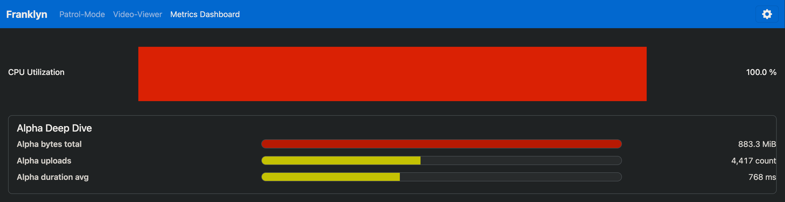
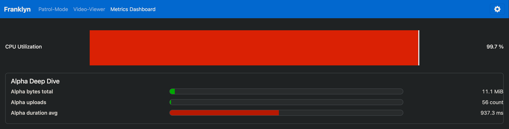
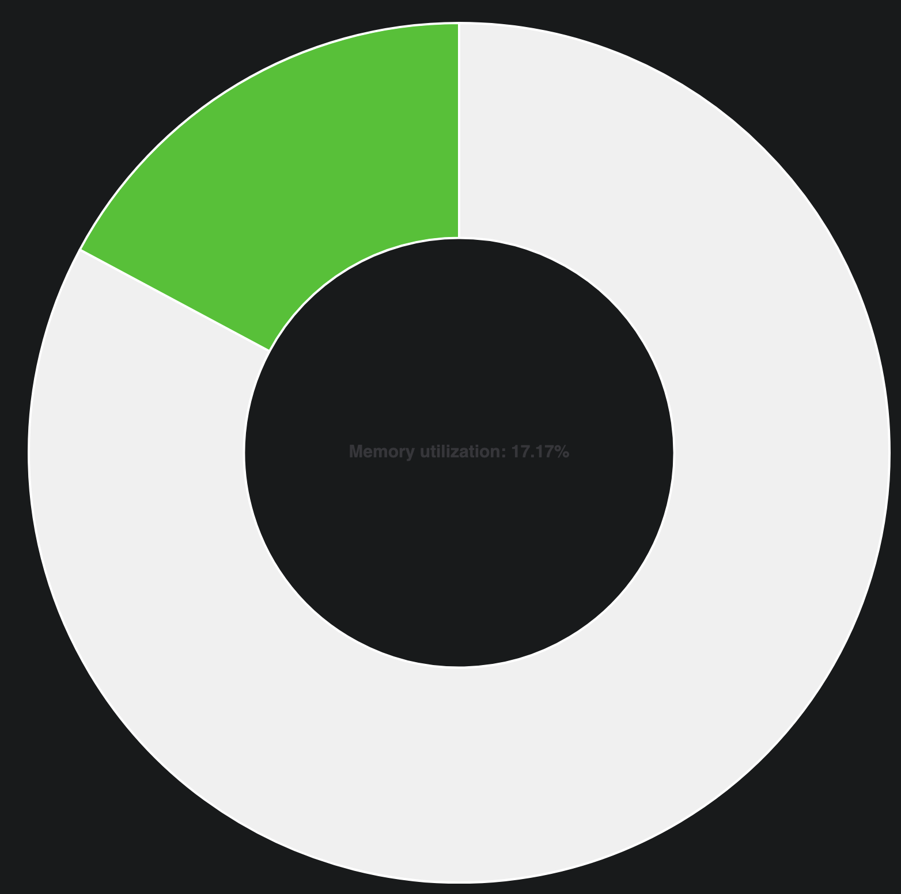

## Problem

Teachers saw heavy slowdowns on the Franklyn server: the student video preview
updated every **3 minutes** instead of the planned **5 seconds**.

## Agreement

We agreed to find the cause by building a simple load
tester (see [Issue #65](https://github.com/2526-4ahitm-itp/2526-4ahitm-franklyn/issues/65))
to reproduce the problem and analyze the server while it is running.

## Approach

We reused the openbox project and added these settings:

-   `spread`: how spread out the client requests are (1 = spread, 0 = burst)
-   `clients`: number of clients sending requests
-   `interval`: seconds between requests per client (default 5s)
-   `noise`: how much noise the image contains (0 – 1)
    -   this affects PNG compression time (the more noise the more time it takes)
-   `prefix`: text added before each random client name that shows up in the instructor webui

A local run showed the tester is limited solely by bandwidth at around 2 GiB/s from a single laptop,
so the only real bottleneck is bandwidth, meaning it is fully capable of stressing the Franklyn server to the point of a DDoS.
The Franklyn server ran on the Franklyn 1 server and was
port-forwarded to local 8080 from inside the school network to a local machine:

```shell
ssh -L 8080:localhost:8080 franklyn@franklyn.htl-leonding.ac.at
```

## Test Runs (grouped)

All runs used `--noise 0.23 --spread 1 --interval 5`. The noise of 0.23 makes the
server take ~400 ms to encode a single image to a PNG.

-   **Run 1 — 75 clients** (`cargo run -- --clients 75`)

    -   CPU: goes to **100%**, then stable around **80+%**
    -   Throughput: about **15 requests/s**
    -   Per frame per thread: **~400 ms**

-   **Run 2 — 80 clients** (`cargo run -- --clients 80`)

    -   CPU: often **100%**, mostly around **95%**
    -   Throughput: about **16 requests/s**
    -   Per frame per thread: **~750 ms**

-   **Run 3 — 90 clients** (`cargo run -- --clients 90`)
    -   CPU: **100%** all the time
    -   Per frame per thread: starts near **827 ms**, climbs to **~4500 ms** after 2:30
    -   Throughput: maxed out at about **16-17 requests/s**
    -   Response times: API calls take several seconds
    -   Memory usage: 17% - 20%

## Observations

-   The client sends a full frame every time instead of sending delta frames.
-   The bottleneck is encoding the image from a ByteArray and saving it to disk.

## Conclusion

The server was slightly overwhelmed with 90 clients.
This required 18 requests per second but the server can only handle 16-17 max.
Because the server will accept every single request and has many requests pending
the time for processing the images increases. Now that even fewer images are being
processed, encoding times skyrocket and lead to a **3 minute delay** after some time
in the test.

## Solution

Processing all frames locally per client and sending PNGs to the server
and letting the server just handle communication will not put so much stress on
the server.
This will lead to a **~90+%** performance gain as image encoding currently
takes about **~90+%** of the whole server load.

## Images

### 75 clients

**413.1 ms** average frame time


### 80 clients

**768 ms** average frame time



### 90 clients (5 seconds after start)

**827.3 ms** average frame time



After 2 minutes and 30 seconds

**3 252.1 ms** average frame time


#### Memory Usage


