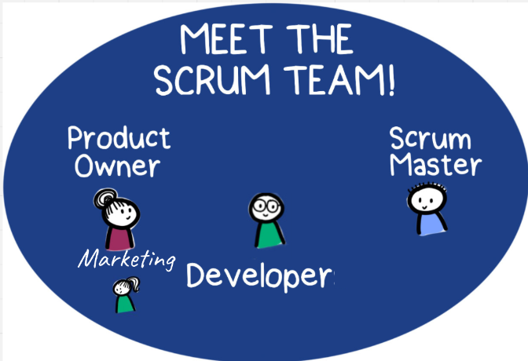

# Meet the Scrum Team

# Scrum of Franklyn

The scrum team of franklyn is very complex and consists of three subteams. All of
them have important tasks and the will to do whatever is necessary in order to
stay in time and to be able to complete the given tasks. This team not only works
on this project as a team, their relationships go far beyond this project and this
is also why the success of this project is most certainly guaranteed. But without
further information or glazing of the team, you may now get introduced to them
by the graph below

## Meet the Scrum Team

### Jakob - Scrum Master

As the Scrum Master Jakob not only makes sure that progress is happening in the
project. He also is the most talented programmer(who only sleeps 1 hour a day)
in the team and therefore also is able to help his teammates or develop solutions
on his own

### Eldin - Developer

As a guy who only sleeps 2 hours he can put out a lot of work and help achieve
progress in the project when its needed the most.

### Gregor - Marketing

As the marketing part of the team and with 4 hours of sleep a day Gregor manages to
hold the worst prepared presentations in the best way possible. Achieving the
trust of customers. He is also able to code, but he is not nearly as
talented as his teammates Jakob and Eldin.

### Clemens - Product Owner

As a guy with 8 hours of sleep daily he is very productive in the time being awake.
He also keeps the mood of the team up until 10pm, because then he goes to sleep.
Without Clemens the team would be very depressed and therefore he may be the most
valuable team member.

## Alertteams

### Programming - Clemens(Emergency: Gregor), Eldin, Jakob

This team is for the programming responsible for programming fast and putting out
releases as fast as possible when needed.

### Marketing - Gregor, Jakob(Emergency: Eldin)

In this team Gregor is responsible for giving a brief overview at an event and then
Jakob coming in clutch with the details of the project and the used technology.

### Nightshift - Gregor, Eldin, Jakob(No Emergencies for this team)

This teams makes sure that there is something to talk about at the presentation the
next day. If they need to they will work from 6pm to 5:30am and then go lay in bed,
so that their moms think they slept.

